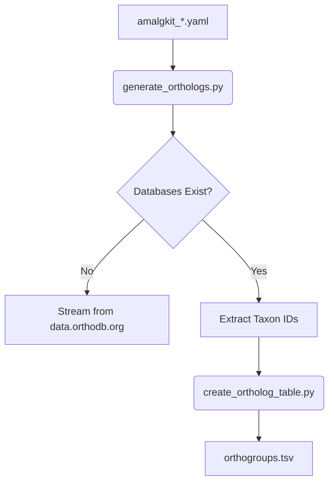

# Ortholog Generation

Across-species analyses in amalgkit (`cstmm`, `csca`) require an `orthogroups.tsv` (or `Orthogroups.tsv`) table that maps gene IDs across different species. MetaInformAnt provides an automated workflow to generate this table using OrthoDB v12 data.

## Workflow Overview

Generating ortholog mappings manually is error-prone and time-consuming. MetaInformAnt automates this through a single orchestrator that syncs the required 5GB+ of genomic databases and extracts the relevant taxonomy IDs.



## Core Components

### 1. `generate_orthologs.py`
The top-level orchestrator.
-   **Discovery**: Automatically parses all `config/amalgkit/amalgkit_*.yaml` files to find configured `taxon_id`s.
-   **Synchronization**: Downloads required OrthoDB v12 files if missing from `.cache/orthodb/`.
-   **Execution**: Triggers the extraction logic.

```bash
# Automated generation for all configured species
python3 scripts/rna/generate_orthologs.py
```

### 2. `create_ortholog_table.py`
The extraction engine.
-   Filters the massive OrthoDB gene-to-OG tables for the specific taxonomy IDs of interest.
-   Produces the standard `orthogroups.tsv` format expected by `amalgkit cstmm`.

## Configuration

Species are included in ortholog generation if they have a `taxon_id` defined in their amalgkit YAML:

```yaml
# config/amalgkit/amalgkit_acromyrmex_echinatior.yaml
taxon_id: 103372
...
```

## Data Sources

The workflow uses **OrthoDB v12.2** as the source of truth, specifically:
-   `odb12v2_genes.tab.gz`: Gene ID mappings.
-   `odb12v2_OG2genes.tab.gz`: Orthogroup to Gene ID mappings.

These are retrieved securely from `https://data.orthodb.org/v12/`.

## Validation

The ortholog generation workflow is validated via:
-   **Automated Tests**: [test_ortholog_generation.py](../../../tests/other/test_ortholog_generation.py) verifies correct Taxon ID extraction from configuration files.
-   **Output Integrity**: Verified by the `cstmm` step, which fails if the ortholog table contains invalid IDs or mismatched headers.
