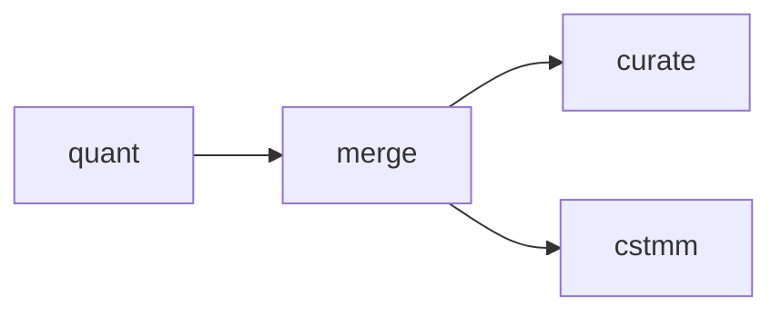

# amalgkit merge: Transcript Abundance Table Generation

## Purpose

Combines individual sample abundance estimates into unified expression matrices. This step **aggregates** all quantification results into analysis-ready data tables.

## Overview

The `merge` step:
- Collects `abundance.tsv` files from all quantified samples
- Generates unified expression matrices
- Produces multiple output formats (counts, TPM, effective lengths)
- Handles missing samples gracefully
- Creates sample-by-transcript matrices
- **Requires R and ggplot2**: For generating visualization plots (PCA, correlation heatmaps)

**R Dependency**: The merge step requires R and the `ggplot2` package for plotting. If R is not installed, merge will still create expression matrices but will skip plot generation. See [R_INSTALLATION.md](../R_INSTALLATION.md) for installation instructions.

## Usage

### Basic Usage

```bash
amalgkit merge \
  --out_dir output/amalgkit/work \
  --metadata output/amalgkit/work/metadata/pivot_qualified.tsv
```

### Python API

```python
from metainformant.rna import amalgkit

result = amalgkit.merge(
    out_dir="output/amalgkit/work",
    metadata="output/amalgkit/work/metadata/pivot_qualified.tsv"
)
```

### Configuration File

```yaml
steps:
  merge:
    # If quant used out_dir: work_dir, merge should use work_dir or copy files
    # Option 1: Use same work_dir as quant
    out_dir: output/amalgkit/amellifera/work
    # Option 2: Use separate merged directory (requires copying abundance files)
    # out_dir: output/amalgkit/amellifera/merged
    metadata: output/amalgkit/amellifera/work/metadata/pivot_qualified.tsv
```

## Parameters

### Optional Parameters

| Parameter | Type | Default | Description |
|-----------|------|---------|-------------|
| `--out_dir` | PATH | `./` | Directory for intermediate and output files. |
| `--metadata` | PATH | `inferred` | Path to metadata.tsv. Default: `out_dir/metadata/metadata.tsv` |

## Input Requirements

### Prerequisites

- **Quantification Results**: `abundance.tsv` files from `amalgkit quant` (in `{quant_out_dir}/quant/{sample_id}/abundance.tsv`)
  - **Path Resolution**: `amalgkit merge` looks for abundance files in `{out_dir}/quant/{sample_id}/{sample_id}_abundance.tsv` relative to its `out_dir` parameter
  - **Critical**: If `quant` used `out_dir: work_dir` (e.g., `output/amalgkit/{species}/work`), then merge's `out_dir` should either:
    - Be set to the same `work_dir` so it can find quant output in `{work_dir}/quant/`, OR
    - Point to a location where abundance files have been copied/symlinked
  - The workflow may copy abundance files to `{merge_out_dir}/quant/{sample_id}/{sample_id}_abundance.tsv` to ensure merge can find them
- **Metadata Table**: Sample metadata with SRA IDs
- **R and ggplot2** (optional but recommended): For generating visualization plots

### Expected Input Structure

**Important**: `amalgkit merge` looks for abundance files in `{out_dir}/quant/{sample_id}/{sample_id}_abundance.tsv`. If quant used `out_dir: work_dir`, the files will be in `{work_dir}/quant/{sample_id}/abundance.tsv`. Merge's `out_dir` should be set accordingly.

```
{out_dir}/quant/
├── SRR12345678/
│   └── SRR12345678_abundance.tsv  # Note: filename includes sample_id prefix
├── SRR12345679/
│   └── SRR12345679_abundance.tsv
└── SRR12345680/
    └── SRR12345680_abundance.tsv
```

**Example**: If quant used `out_dir: output/amalgkit/pbarbatus/work`, then:
- Quant output: `output/amalgkit/pbarbatus/work/quant/SRR12345678/abundance.tsv`
- Merge should either:
  - Use `out_dir: output/amalgkit/pbarbatus/work` (same as quant), OR
  - Copy files to `output/amalgkit/pbarbatus/merged/quant/SRR12345678/SRR12345678_abundance.tsv`

## Output Files

### Directory Structure

```
out_dir/merge/
└── {Scientific_Name}/
    ├── {Scientific_Name}_tc.tsv              # ⭐ Estimated counts matrix
    ├── {Scientific_Name}_tpm.tsv             # ⭐ TPM (normalized) matrix
    ├── {Scientific_Name}_eff_len.tsv         # Effective lengths matrix
    ├── {Scientific_Name}_sample_info.tsv     # Sample metadata
    └── merge_summary.txt                     # Merge statistics
```

### Primary Outputs

**1. Counts Matrix (`_tc.tsv`)**

Tab-delimited matrix with estimated read counts:

```
transcript_id       SRR12345678  SRR12345679  SRR12345680
XM_006566778.3      1234.00      2456.50      987.25
XM_006566779.2      567.50       1123.75      445.00
XM_006566780.1      89.00        178.50       71.25
```

- Rows: Transcripts
- Columns: Samples (SRA IDs)
- Values: Estimated read counts

**2. TPM Matrix (`_tpm.tsv`)**

Transcripts Per Million (normalized expression):

```
transcript_id       SRR12345678  SRR12345679  SRR12345680
XM_006566778.3      15.23        18.45        12.89
XM_006566779.2      5.87         6.23         4.95
XM_006566780.1      2.19         2.78         1.87
```

- Rows: Transcripts
- Columns: Samples
- Values: TPM (normalized, comparable across samples)

**3. Effective Length Matrix (`_eff_len.tsv`)**

Effective transcript lengths (accounts for fragment distribution):

```
transcript_id       SRR12345678  SRR12345679  SRR12345680
XM_006566778.3      1672.00      1672.00      1672.00
XM_006566779.2      1996.00      1996.00      1996.00
XM_006566780.1      838.00       838.00       838.00
```

**4. Sample Information (`_sample_info.tsv`)**

Metadata for merged samples:

```
sample_id       scientific_name     sample_group  n_reads     p_aligned
SRR12345678     Apis mellifera      brain         5876543     64.5
SRR12345679     Apis mellifera      brain         6123456     67.2
SRR12345680     Apis mellifera      brain         5234567     62.8
```

## Workflow Integration

### Position in Pipeline



**merge** runs **after quant**, **before curate/cstmm**.

### Downstream Dependencies

| Step | Uses | Description |
|------|------|-------------|
| `curate` | TPM and counts matrices | QC, outlier removal, batch correction |
| `cstmm` | Counts matrix | Cross-species TMM normalization |
| `csca` | Curated matrices | Cross-species correlation analysis |

## Matrix Formats

### Counts vs TPM

**Counts (`_tc.tsv`)**:
- Raw estimated read counts
- Use for: Differential expression (DESeq2, edgeR)
- Not normalized across samples
- Integer-like values (kallisto estimates can be fractional)

**TPM (`_tpm.tsv`)**:
- Transcripts Per Million
- Use for: Cross-sample comparison, visualization, clustering
- Normalized for transcript length and sequencing depth
- Directly comparable across samples

**Relationship**:
```
TPM_i = (count_i / eff_length_i) / sum(count_j / eff_length_j) × 10^6
```

### When to Use Each

| Analysis | Use |
|----------|-----|
| **Differential expression** | Counts (`_tc.tsv`) |
| **Visualization** | TPM (`_tpm.tsv`) |
| **Clustering/PCA** | TPM (`_tpm.tsv`) or log2(TPM+1) |
| **Cross-sample comparison** | TPM (`_tpm.tsv`) |
| **GSEA/pathway analysis** | TPM (`_tpm.tsv`) |
| **Cross-species** | Counts → TMM normalization (via `cstmm`) |

## Performance Considerations

### Runtime

- **Small datasets** (<10 samples): <1 second
- **Medium datasets** (10-100 samples): 1-10 seconds
- **Large datasets** (100-1000 samples): 10-60 seconds
- **Very large datasets** (>1000 samples): 1-5 minutes

### Memory Usage

- Minimal: <500MB for most datasets
- Scales with (# transcripts) × (# samples)

### Disk Space

- **Per species**: 10-100MB for matrices
- Depends on # transcripts and # samples

## Common Use Cases

### 1. Standard Merge

```bash
# Merge all quantified samples
amalgkit merge \
  --out_dir output/amalgkit/amellifera/work
```

**Result**: Generates counts, TPM, and effective length matrices

### 2. Merge Specific Sample Set

```bash
# Merge only selected samples
amalgkit merge \
  --out_dir output/amalgkit/work \
  --metadata output/amalgkit/work/metadata/pivot_selected.tsv
```

**Result**: Merges only samples listed in pivot_selected.tsv

### 3. Merge Multiple Species

```bash
# For each species
for species in amellifera pbarbatus cfloridanus; do
    amalgkit merge \
      --out_dir output/amalgkit/${species}/work \
      --metadata output/amalgkit/${species}/work/metadata/pivot_qualified.tsv
done
```

**Result**: Separate matrices for each species

## Troubleshooting

### Issue: No abundance files found

```
Error: No abundance.tsv files found in quant directory
```

**Diagnosis**:
```bash
# Check if quant completed
find output/work/quant -name "abundance.tsv" | wc -l
# Should be > 0
```

**Solutions**:
1. Run quant step first:
   ```bash
   amalgkit quant --out_dir output/work
   ```

2. Verify quant output structure:
   ```bash
   ls output/work/quant/*/abundance.tsv
   ```

3. Check metadata for correct SRA IDs:
   ```bash
   cut -f1 output/work/metadata/pivot_qualified.tsv
   ```

### Issue: Missing samples in matrix

**Diagnosis**:
```bash
# Count samples in metadata
wc -l output/work/metadata/pivot_qualified.tsv
# vs samples in matrix (columns)
head -1 output/work/merge/Species_name/Species_name_tc.tsv | tr '\t' '\n' | wc -l
```

**Causes**:
1. Quant failed for some samples
2. Samples removed due to low quality
3. Metadata doesn't match quant outputs

**Solutions**:
1. Check which samples have quant outputs:
   ```bash
   ls output/work/quant/
   ```

2. Identify missing:
   ```bash
   cut -f1 output/work/metadata/pivot_qualified.tsv | while read srr; do
       if [ ! -f "output/work/quant/$srr/abundance.tsv" ]; then
           echo "Missing: $srr"
       fi
   done
   ```

3. Re-quantify missing samples:
   ```bash
   # Create metadata with only missing samples
   amalgkit quant --metadata missing_samples.tsv
   amalgkit merge  # Re-merge
   ```

### Issue: Transcript ID mismatch

```
Warning: Some transcripts not found in all samples
```

**Causes**:
1. Different index versions used for different samples
2. Index updated mid-analysis

**Solutions**:
1. Re-quantify all samples with same index:
   ```bash
   amalgkit quant --redo yes --index_dir output/work/index
   amalgkit merge
   ```

2. Verify index consistency:
   ```bash
   # Check all samples used same index
   grep "index_version" output/work/quant/*/run_info.json
   ```

### Issue: Empty matrix generated

**Diagnosis**:
```bash
# Check matrix size
wc -l output/work/merge/Species_name/Species_name_tc.tsv
# Should show # transcripts + 1 header
```

**Solutions**:
1. Check abundance files aren't empty:
   ```bash
   wc -l output/work/quant/*/abundance.tsv
   ```

2. Verify samples passed quality filters:
   ```bash
   cat output/work/quant/*/run_info.json | grep "p_pseudoaligned"
   ```

### Issue: R/ggplot2 not found (plotting fails)

```
Error in library(ggplot2, quietly = TRUE) : there is no package called 'ggplot2'
```

**Diagnosis**:
```bash
# Check if R is installed
which R
R --version

# Check if ggplot2 is installed
Rscript -e "library(ggplot2)"
```

**Solutions**:
1. Install R (if not installed):
   ```bash
   sudo apt-get update
   sudo apt-get install -y r-base r-base-dev
   ```

2. Install ggplot2:
   ```bash
   Rscript -e "install.packages('ggplot2', repos='https://cloud.r-project.org')"
   ```

3. Verify installation:
   ```bash
   Rscript -e "library(ggplot2); cat('ggplot2 version:', packageVersion('ggplot2'), '\n')"
   ```

**Note**: If R/ggplot2 is not available, merge will still create expression matrices but will skip plot generation. The core functionality (matrix creation) does not require R.

## Best Practices

### 1. Verify Merge Completeness

```bash
# Check all expected samples are present
head -1 output/work/merge/Species_name/Species_name_tc.tsv | tr '\t' '\n' | tail -n +2 > merged_samples.txt
cut -f1 output/work/metadata/pivot_qualified.tsv | tail -n +2 > expected_samples.txt
diff merged_samples.txt expected_samples.txt
```

### 2. Inspect Matrix Dimensions

```bash
# Check matrix size
wc -l output/work/merge/Species_name/Species_name_tc.tsv
# Rows = # transcripts + 1 header

head -1 output/work/merge/Species_name/Species_name_tc.tsv | tr '\t' '\n' | wc -l
# Columns = # samples + 1 transcript_id
```

### 3. Validate Expression Values

```bash
# Check for reasonable values
head -20 output/work/merge/Species_name/Species_name_tpm.tsv

# Check for missing values (should be none)
grep "NA\|NaN" output/work/merge/Species_name/Species_name_tpm.tsv
```

### 4. Compare with Individual Samples

```bash
# Verify a sample's values match
sample="SRR12345678"
transcript="XM_006566778.3"

# From original abundance.tsv
grep "$transcript" output/work/quant/$sample/abundance.tsv

# From merged matrix
grep "$transcript" output/work/merge/Species_name/Species_name_tc.tsv | cut -f2
# Should match est_counts from abundance.tsv
```

## Real-World Examples

### Example 1: Apis mellifera (83 Samples)

```bash
amalgkit merge \
  --out_dir output/amalgkit/amellifera/work \
  --metadata output/amalgkit/amellifera/work/metadata/pivot_qualified.tsv
```

**Result**:
- Generated matrices: 83 samples × 20,672 transcripts
- Counts matrix: 10.2 MB
- TPM matrix: 10.5 MB
- Runtime: 5 seconds

### Example 2: Multi-Species Analysis

```bash
# Merge each species separately
species_list="amellifera pbarbatus cfloridanus dmelanogaster linepithema"

for species in $species_list; do
    echo "Merging $species..."
    amalgkit merge \
      --out_dir output/amalgkit/${species}/work \
      --metadata output/amalgkit/${species}/work/metadata/pivot_qualified.tsv
done
```

**Result**: 5 species-specific expression matrices ready for cross-species analysis

### Example 3: Quality Control Check

```bash
# Merge with verbose output
amalgkit merge \
  --out_dir output/work

# Check merge summary
cat output/work/merge/Species_name/merge_summary.txt

# Outputs:
# Total samples in metadata: 120
# Samples with quant outputs: 118
# Samples included in matrix: 118
# Missing samples: SRR12345678, SRR12345679
# Total transcripts: 20,672
# Transcripts with expression: 16,988 (82.2%)
```

## Downstream Analysis

### Loading Matrices in Python

```python
import pandas as pd

# Load TPM matrix
tpm = pd.read_csv(
    "output/work/merge/Apis_mellifera/Apis_mellifera_tpm.tsv",
    sep="\t",
    index_col=0
)

print(f"Matrix shape: {tpm.shape}")
print(f"Samples: {tpm.columns.tolist()}")
print(f"Transcripts: {len(tpm)}")

# Calculate mean expression per gene
mean_expr = tpm.mean(axis=1).sort_values(ascending=False)
print(f"\nTop 10 expressed transcripts:")
print(mean_expr.head(10))
```

### Loading Matrices in R

```r
# Load counts matrix
counts <- read.delim(
    "output/work/merge/Apis_mellifera/Apis_mellifera_tc.tsv",
    row.names = 1
)

# Load TPM matrix
tpm <- read.delim(
    "output/work/merge/Apis_mellifera/Apis_mellifera_tpm.tsv",
    row.names = 1
)

# Basic statistics
dim(counts)  # transcripts × samples
summary(colSums(counts))  # Total counts per sample

# Filter lowly expressed genes
expressed <- rowMeans(tpm) > 1
counts_filtered <- counts[expressed, ]
```

## Integration with METAINFORMANT Workflow

### Automatic Execution

```python
from metainformant.rna.workflow import execute_workflow, load_workflow_config

cfg = load_workflow_config("config/amalgkit_amellifera.yaml")
execute_workflow(cfg)  # merge runs automatically after quant
```

### Accessing Merged Data

```python
from pathlib import Path
import pandas as pd

# Load merged TPM matrix
work_dir = Path("output/amalgkit/amellifera/work")
tpm_file = work_dir / "merge" / "Apis_mellifera" / "Apis_mellifera_tpm.tsv"
tpm = pd.read_csv(tpm_file, sep="\t", index_col=0)

print(f"Loaded expression matrix: {tpm.shape[1]} samples, {tpm.shape[0]} transcripts")
```

## References

- **TPM Normalization**: https://www.rna-seqblog.com/rpkm-fpkm-and-tpm-clearly-explained/
- **Expression Analysis**: https://bioconductor.org/packages/release/workflows/html/rnaseqGene.html
- **METAINFORMANT Workflow**: `docs/rna/workflow.md`

## See Also

- **Previous Step**: [`06_quant.md`](06_quant.md) - Transcript quantification
- **Next Step**: [`09_curate.md`](09_curate.md) - Quality control and batch correction
- **Next Step**: [`08_cstmm.md`](08_cstmm.md) - Cross-species TMM normalization
- **Workflow Overview**: [`../amalgkit.md`](../amalgkit.md)
- **Testing**: `tests/test_rna_amalgkit_steps.py::test_merge_basic_execution`

---

**Last Updated**: October 29, 2025  
**AMALGKIT Version**: 0.12.19  
**Status**: ✅ Production-ready, comprehensively tested


