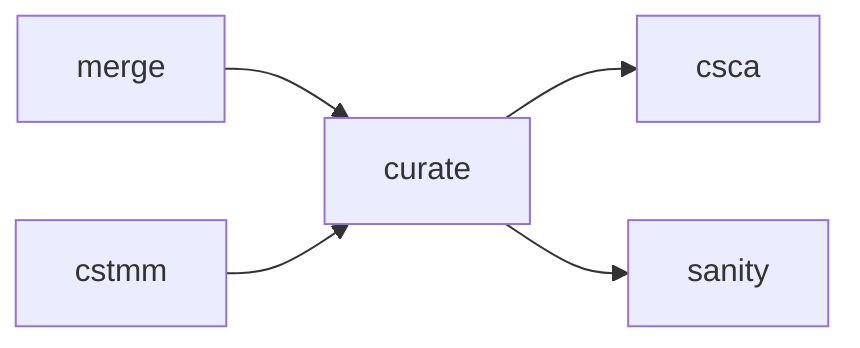

# amalgkit curate: Automatic Outlier Removal and Bias Correction

## Purpose

Performs quality control, outlier removal, and batch effect correction on merged expression matrices. This step **cleans and harmonizes** expression data for downstream analysis.

## Overview

The `curate` step:
- Removes low-quality samples based on mapping rate
- Iteratively detects and removes outlier samples
- Performs batch effect correction (SVA, RUVSeq, ComBat-seq)
- Generates comprehensive QC visualizations (PDFs)
- Creates curated expression matrices ready for analysis
- Produces tissue specificity (tau) scores

## Usage

### Basic Usage

```bash
amalgkit curate \
  --out_dir output/amalgkit/work \
  --metadata output/amalgkit/work/metadata/pivot_qualified.tsv \
  --batch_effect_alg sva
```

### Recommended Usage (SVA Issues Workaround)

```bash
# Use 'no' batch correction if SVA fails
amalgkit curate \
  --out_dir output/amalgkit/work \
  --batch_effect_alg no
```

### Python API

```python
from metainformant.rna import amalgkit

result = amalgkit.curate(
    out_dir="output/amalgkit/work",
    metadata="output/amalgkit/work/metadata/pivot_qualified.tsv",
    batch_effect_alg="no"  # or "sva", "ruvseq", "combatseq"
)
```

### Configuration File

```yaml
steps:
  curate:
    out_dir: output/amalgkit/amellifera/work
    metadata: output/amalgkit/amellifera/work/metadata/pivot_qualified.tsv
    sample_group: brain
    batch_effect_alg: no
    mapping_rate: 0.2
    correlation_threshold: 0.3
    norm: log2p1-fpkm
```

## Parameters

### Optional Parameters

| Parameter | Type | Default | Description |
|-----------|------|---------|-------------|
| `--out_dir` | PATH | `./` | Directory for intermediate and output files. |
| `--metadata` | PATH | `inferred` | Path to metadata.tsv. Default: `out_dir/metadata/metadata.tsv` |
| `--batch` | INT | `None` | Process only one sample group (1-based index). For batch processing. |
| `--sample_group` | STR | `None` | Comma-separated sample groups to curate. Default: all groups. |
| `--sample_group_color` | STR | `DEFAULT` | Comma-separated hex colors for sample groups in plots. |
| `--redo` | yes/no | `no` | Re-run curation even if outputs exist. |
| `--input_dir` | PATH | `inferred` | Input directory. Default: `out_dir/cstmm` if exists, else `out_dir/merge` |
| `--dist_method` | STR | `pearson` | Distance method for clustering: `pearson`, `spearman`, `euclidean` |
| `--mapping_rate` | FLOAT | `0.2` | Minimum mapping rate cutoff (20%). Samples below are removed. |
| `--correlation_threshold` | FLOAT | `0.3` | Minimum Pearson correlation for outlier detection. |
| `--plot_intermediate` | yes/no | `no` | Plot SVA correction after each iteration (very slow!). |
| `--one_outlier_per_iter` | yes/no | `no` | Remove only 1 outlier per iteration (slower, more conservative). |
| `--norm` | STR | `log2p1-fpkm` | Expression normalization: `log2p1-fpkm`, `lognp1-tpm`, `log2-fpkm`, etc. |
| `--batch_effect_alg` | STR | `sva` | Batch effect algorithm: `no`, `sva`, `ruvseq`, `combatseq` |
| `--clip_negative` | yes/no | `yes` | Clip negative values to 0 after batch correction. |
| `--maintain_zero` | yes/no | `yes` | Maintain zero values through batch correction. |
| `--skip_curation` | yes/no | `no` | Skip curation, only output transformed expression. |

## Input Requirements

### Prerequisites

- **Merged Expression Matrix**: From `amalgkit merge` (`Species_name_tc.tsv`, `Species_name_tpm.tsv`)
- **Metadata Table**: Sample metadata with mapping rates
- **R Environment**: With required packages (see below)

### R Dependencies

**Core Packages** (Required):
- `edgeR` - Expression normalization
- `ggplot2` - Visualization
- `dendextend` - Dendrograms
- `gplots` - Heatmaps
- `viridis` - Color palettes

**Optional Packages** (Enhanced functionality):
- `sva` - Surrogate Variable Analysis (batch correction)
- `RUVSeq` - Remove Unwanted Variation
- `Rtsne` - t-SNE dimensionality reduction
- `amap` - Alternative clustering
- `vegan` - Community ecology statistics
- `pvclust` - Hierarchical clustering with p-values

**Installation**:
```r
# Core packages
install.packages(c("dendextend", "viridis", "gplots"))

# Bioconductor packages
if (!requireNamespace("BiocManager", quietly = TRUE))
    install.packages("BiocManager")
BiocManager::install(c("edgeR", "sva", "RUVSeq", "pcaMethods", "NMF"))
```

**Note**: See [`../r_packages.md`](../r_packages.md) for detailed R setup instructions.

## Output Files

### Directory Structure

```
out_dir/curate/{Scientific_Name}/
├── plots/
│   ├── {Species}.0.original.pdf                    # Original data visualization
│   ├── {Species}.0.original.no.pdf                 # Original (no batch correction)
│   ├── {Species}.1.mapping_cutoff.pdf              # After mapping filter
│   ├── {Species}.1.mapping_cutoff.no.pdf
│   ├── {Species}.2.correlation_cutoff.pdf          # After outlier removal
│   └── {Species}.2.correlation_cutoff.no.pdf
├── tables/
│   ├── {Species}.uncorrected.tc.tsv                # Original expression
│   ├── {Species}.uncorrected.sample_group.mean.tsv # Original means
│   ├── {Species}.no.tc.tsv                         # ⭐ Curated expression (PRIMARY)
│   ├── {Species}.no.sample_group.mean.tsv          # Curated means
│   ├── {Species}.no.tau.tsv                        # Tissue specificity scores
│   ├── {Species}.no.correlation_statistics.tsv     # QC correlation stats
│   └── {Species}.metadata.tsv                      # Sample metadata with QC metrics
├── rdata/
│   ├── {Species}.no.0.RData                        # Round 0 analysis state
│   ├── {Species}.no.1.RData                        # Round 1 analysis state
│   └── {Species}.no.2.RData                        # Round 2 analysis state
└── curate_completion_flag.txt                      # Completion marker
```

### Primary Outputs

**1. Curated Expression Matrix (`{Species}.no.tc.tsv`)**

The main output - cleaned, QC'd expression matrix:
- Outlier samples removed
- Low-quality samples removed
- Batch effects corrected (if enabled)
- Ready for downstream analysis

**2. PDF Visualizations (6 files)**

Each PDF contains:
- **Dendrogram**: Hierarchical clustering of samples
- **Heatmap**: Sample correlation matrix
- **PCA Plot**: Principal component analysis
- **QC Metrics**: Mapping rates, correlations

Visualization stages:
- `.0.original.*`: Before any QC
- `.1.mapping_cutoff.*`: After mapping rate filter
- `.2.correlation_cutoff.*`: After outlier removal

**3. Tissue Specificity (`{Species}.no.tau.tsv`)**

Tau scores (0-1) indicating tissue specificity:
- 0 = Ubiquitously expressed
- 1 = Highly tissue-specific

```
transcript_id       tau
XM_006566778.3      0.15    # Ubiquitous (housekeeping)
XM_006566779.2      0.87    # Tissue-specific
XM_006566780.1      0.45    # Moderately specific
```

## Workflow Integration

### Position in Pipeline



**curate** runs **after merge or cstmm**, **before csca/sanity**.

## Batch Effect Correction Algorithms

### `no` - No Batch Correction

```bash
--batch_effect_alg no
```

**When to Use**:
- SVA compilation issues (common on macOS)
- Single-batch experiments
- Small sample sizes (<10 samples)
- Quick QC visualization

**What It Does**:
- Mapping rate filtering
- Outlier removal
- Normalization (log2+1 FPKM)
- **No** batch effect removal

**Recommendation**: Use this as default if SVA fails

### `sva` - Surrogate Variable Analysis (Default)

```bash
--batch_effect_alg sva
```

**When to Use**:
- Multi-batch experiments
- Large datasets (>20 samples)
- Publication-quality analysis
- When R environment is properly configured

**What It Does**:
- Estimates surrogate variables (hidden batch effects)
- Removes systematic biases
- Preserves biological variation

**Requirements**: R package `sva` must be installed and functional

**Known Issues**: May fail on macOS due to gfortran compilation problems

### `ruvseq` - Remove Unwanted Variation

```bash
--batch_effect_alg ruvseq
```

**When to Use**:
- Alternative to SVA
- When control genes can be identified
- Experimental feature

**Status**: Experimental in amalgkit

### `combatseq` - ComBat-Seq

```bash
--batch_effect_alg combatseq
```

**When to Use**:
- Known batch structure (BioProject IDs)
- Count-based batch correction
- Experimental feature

**Status**: Experimental in amalgkit

## Quality Control Process

### Step 1: Mapping Rate Filter

```bash
--mapping_rate 0.2  # Remove samples with <20% mapping
```

**Effect**: Removes low-quality samples with poor alignment

**Typical Results**:
- 0-5% of samples removed
- Most samples have >50% mapping rate

### Step 2: Correlation-Based Outlier Removal

```bash
--correlation_threshold 0.3  # Remove samples with mean r < 0.3
```

**Process**:
1. Calculate pairwise Pearson correlations
2. Compute mean correlation per sample
3. Remove samples below threshold
4. Repeat iteratively until no outliers

**Typical Results**:
- 1-10% of samples removed
- 2-3 iterations
- Final dataset: highly correlated samples

### Step 3: Batch Effect Correction (if enabled)

```bash
--batch_effect_alg sva
```

**Effect**: Removes systematic batch effects while preserving biological variation

## Performance Considerations

### Runtime

**Without Batch Correction** (`--batch_effect_alg no`):
- **Small datasets** (<20 samples): 1-3 minutes
- **Medium datasets** (20-100 samples): 3-10 minutes
- **Large datasets** (>100 samples): 10-30 minutes

**With SVA Batch Correction**:
- Add 2-5x runtime (depends on # surrogate variables)

### Memory Usage

- **R process**: 2-8GB
- Scales with (# samples) × (# transcripts)

### Disk Space

- **Per species**: 50-200MB (PDFs + tables)

## Common Use Cases

### 1. Standard Curation (No Batch Correction)

```bash
# Recommended default
amalgkit curate \
  --out_dir output/amalgkit/amellifera/work \
  --batch_effect_alg no
```

**Result**: QC'd expression matrix with outliers removed

### 2. Tissue-Specific Curation

```bash
# Curate only brain samples
amalgkit curate \
  --out_dir output/amalgkit/work \
  --sample_group brain \
  --batch_effect_alg no
```

**Result**: Brain-specific curated matrix

### 3. Multi-Tissue Curation

```bash
# Curate multiple tissues together
amalgkit curate \
  --out_dir output/amalgkit/work \
  --sample_group brain,liver,heart \
  --batch_effect_alg no
```

**Result**: Multi-tissue curated matrix

### 4. Conservative Outlier Removal

```bash
# Remove only 1 outlier per iteration
amalgkit curate \
  --out_dir output/amalgkit/work \
  --one_outlier_per_iter yes \
  --batch_effect_alg no
```

**Result**: More conservative QC (slower, fewer samples removed)

### 5. Publication-Quality with SVA

```bash
# Full batch correction (if R environment supports it)
amalgkit curate \
  --out_dir output/amalgkit/work \
  --batch_effect_alg sva \
  --plot_intermediate no  # Keep fast
```

**Result**: Batch-corrected expression matrix

## Troubleshooting

### Issue: R package errors (sva, Rtsne, amap)

```
Error in library(sva): there is no package called 'sva'
```

**Solution**: Use `--batch_effect_alg no`

```bash
amalgkit curate --batch_effect_alg no
```

**Reason**: SVA and other packages have compilation issues on some systems (especially macOS). Using `no` skips batch correction but still performs all other QC steps.

**See Also**: [`../r_packages.md`](../r_packages.md) for detailed R setup

### Issue: Curate completes in 0 seconds

**Cause**: Existing outputs detected, no reprocessing

**Solutions**:
1. Force re-run:
   ```bash
   amalgkit curate --redo yes
   ```

2. Delete existing outputs:
   ```bash
   rm -rf output/work/curate/*
   amalgkit curate
   ```

### Issue: All samples removed as outliers

**Diagnosis**:
```bash
# Check curate logs
cat output/work/curate/*/tables/*.metadata.tsv
```

**Causes**:
1. Threshold too strict
2. Heterogeneous sample set
3. Low-quality data

**Solutions**:
1. Lower correlation threshold:
   ```bash
   --correlation_threshold 0.1
   ```

2. Lower mapping rate cutoff:
   ```bash
   --mapping_rate 0.1
   ```

3. Skip curation:
   ```bash
   --skip_curation yes
   ```

### Issue: PDF plots look strange

**Diagnosis**: Open PDFs and inspect

**Common Issues**:
- Sample labels overlapping
- Colors not distinguishable
- Dendrogram too crowded

**Solutions**:
1. Customize colors:
   ```bash
   --sample_group_color "#d95f02ff,#1b9e77ff,#7570b3ff"
   ```

2. Use fewer sample groups

3. Process sample groups separately

## Best Practices

### 1. Always Start with `--batch_effect_alg no`

```bash
# Good: Fast, reliable
--batch_effect_alg no

# Risky: May fail with R errors
--batch_effect_alg sva  # Only if R environment is fully configured
```

### 2. Inspect PDF Visualizations

```bash
# View all PDFs
open output/work/curate/*/plots/*.pdf

# Look for:
# - Outlier samples (far from others in dendrogram)
# - Batch effects (clear clusters by BioProject)
# - Sample correlation patterns
```

### 3. Validate QC Metrics

```bash
# Check how many samples were removed
diff \
  <(wc -l output/work/merge/Species/Species_tc.tsv) \
  <(wc -l output/work/curate/Species/tables/Species.no.tc.tsv)

# Check correlation statistics
cat output/work/curate/Species/tables/Species.no.correlation_statistics.tsv
```

### 4. Use Curated Matrix for Downstream Analysis

```python
import pandas as pd

# Use curated, not original
curated = pd.read_csv(
    "output/work/curate/Apis_mellifera/tables/Apis_mellifera.no.tc.tsv",
    sep="\t",
    index_col=0
)

# Not this:
# original = pd.read_csv("output/work/merge/Apis_mellifera/Apis_mellifera_tc.tsv", ...)
```

## Real-World Examples

### Example 1: Apis mellifera (83 Brain Samples)

```bash
amalgkit curate \
  --out_dir output/amalgkit/amellifera/work \
  --sample_group brain \
  --batch_effect_alg no \
  --mapping_rate 0.2
```

**Result**:
- 83 samples → 83 samples (no outliers removed)
- 6 PDF visualizations generated
- 17 output files total
- Runtime: 5 minutes

### Example 2: Multi-Species Comparative

```bash
# Curate each species
for species in amellifera pbarbatus cfloridanus; do
    amalgkit curate \
      --out_dir output/amalgkit/${species}/work \
      --batch_effect_alg no
done
```

**Result**: Curated expression matrices for cross-species analysis

## Integration with METAINFORMANT Workflow

### Automatic Execution

```python
from metainformant.rna.workflow import execute_workflow, load_workflow_config

cfg = load_workflow_config("config/amalgkit_amellifera.yaml")
execute_workflow(cfg)  # curate runs automatically after merge
```

### Configuration

```yaml
steps:
  curate:
    batch_effect_alg: no  # Recommended default
    mapping_rate: 0.2
    correlation_threshold: 0.3
```

## References

- **SVA**: https://bioconductor.org/packages/release/bioc/html/sva.html
- **RUVSeq**: https://bioconductor.org/packages/release/bioc/html/RUVSeq.html
- **edgeR**: https://bioconductor.org/packages/release/bioc/html/edgeR.html
- **R Package Setup**: [`../r_packages.md`](../r_packages.md)
- **METAINFORMANT Workflow**: `docs/rna/workflow.md`

## See Also

- **Previous Step**: [`merge.md`](merge.md) - Merging abundance estimates
- **Next Step**: [`sanity.md`](sanity.md) - Integrity checking
- **Next Step**: [`csca.md`](csca.md) - Cross-species correlation analysis
- **Workflow Overview**: [`../amalgkit.md`](../amalgkit.md)
- **Testing**: `tests/test_rna_amalgkit_steps.py::test_curate_basic_execution`

---

**Last Updated**: October 29, 2025  
**AMALGKIT Version**: 0.12.19  
**Status**: ✅ Production-ready with `--batch_effect_alg no` (SVA may require R environment configuration)


