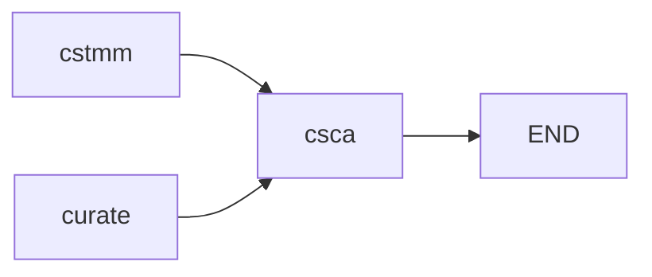

# amalgkit csca: Cross-Species Correlation Analysis

## Purpose

Generates comprehensive plots and statistics for cross-species correlation analysis, enabling visualization and quantification of expression similarity across multiple species. This step produces **publication-ready figures** for comparative transcriptomics.

## Overview

The `csca` step:
- Computes cross-species correlation matrices
- Generates correlation heatmaps
- Creates PCA plots for multi-species datasets
- Produces dendrograms showing species relationships
- Calculates correlation statistics between species
- Generates comprehensive visualization PDFs

## Usage

### Basic Usage

```bash
amalgkit csca \
  --out_dir output/amalgkit/work \
  --metadata output/amalgkit/work/metadata/metadata.tsv \
  --orthogroup_table output/orthogroups/Orthogroups.tsv \
  --dir_busco output/busco
```

### Python API

```python
from metainformant.rna import amalgkit

result = amalgkit.csca(
    out_dir="output/amalgkit/work",
    metadata="output/amalgkit/work/metadata/metadata.tsv",
    orthogroup_table="output/orthogroups/Orthogroups.tsv",
    dir_busco="output/busco"
)
```

### Configuration File

```yaml
steps:
  csca:
    out_dir: output/amalgkit/comparative
    metadata: output/amalgkit/comparative/metadata/metadata.tsv
    orthogroup_table: output/orthogroups/Orthogroups.tsv
    dir_busco: output/busco
    sample_group: brain,liver,heart
    batch_effect_alg: no
```

## Parameters

### Optional Parameters

| Parameter | Type | Default | Description |
|-----------|------|---------|-------------|
| `--out_dir` | PATH | `./` | Directory for intermediate and output files. |
| `--metadata` | PATH | `inferred` | Path to metadata.tsv. Default: `out_dir/metadata/metadata.tsv` |
| `--sample_group` | STR | `None` | Comma-separated sample groups to analyze. Default: all groups. |
| `--sample_group_color` | STR | `DEFAULT` | Comma-separated hex colors for sample groups in plots. |
| `--orthogroup_table` | PATH | `None` | Path to orthogroup table (OrthoFinder `Orthogroups.tsv`). Set to `""` for single-species analysis. |
| `--dir_busco` | PATH | `None` | Path to directory containing per-species BUSCO full tables. |
| `--batch_effect_alg` | STR | `sva` | Batch effect algorithm used in `curate` step: `no`, `sva`, `ruvseq`, `combatseq`. Must match curation step. |

## Input Requirements

### Prerequisites

- **Curated Expression Matrices**: From `amalgkit curate` for each species (or `cstmm` output)
- **Orthogroup Table** (for cross-species): From OrthoFinder
- **BUSCO Results** (optional): For quality filtering
- **R Environment**: With visualization packages

### Expected Input Structure

**For Cross-Species Analysis**:
```
out_dir/curate/  # or out_dir/cstmm/
├── Species1/
│   └── tables/
│       └── Species1.no.tc.tsv    # Curated expression
├── Species2/
│   └── tables/
│       └── Species2.no.tc.tsv    # Curated expression
└── Species3/
    └── tables/
        └── Species3.no.tc.tsv    # Curated expression
```

**OR**:
```
out_dir/cstmm/
└── multi_species/
    └── multi_species_cstmm.tc.tsv  # TMM-normalized cross-species matrix
```

### R Dependencies

**Core Packages**:
- `ggplot2` - Plotting
- `dendextend` - Dendrograms
- `gplots` - Heatmaps
- `viridis` - Color palettes
- `pcaMethods` - PCA

**Optional Packages**:
- `Rtsne` - t-SNE visualization
- `pvclust` - Hierarchical clustering with p-values

**Installation**: See [`../r_packages.md`](../r_packages.md)

## Output Files

### Directory Structure

```
out_dir/csca/
└── {Analysis_Name}/
    ├── plots/
    │   ├── {Analysis_Name}_correlation_heatmap.pdf     # ⭐ Correlation heatmap
    │   ├── {Analysis_Name}_pca.pdf                     # ⭐ PCA plot
    │   ├── {Analysis_Name}_dendrogram.pdf             # ⭐ Hierarchical clustering
    │   └── {Analysis_Name}_sample_correlation.pdf      # Sample correlation matrix
    ├── tables/
    │   ├── {Analysis_Name}_correlation_matrix.tsv     # Correlation values
    │   ├── {Analysis_Name}_species_summary.tsv        # Species statistics
    │   └── {Analysis_Name}_sample_info.tsv           # Sample metadata
    └── csca_summary.txt                                # Analysis summary
```

### Primary Visualizations

**1. Correlation Heatmap (`_correlation_heatmap.pdf`)**

- Shows correlation between all sample pairs
- Color-coded by correlation strength
- Clustered by sample similarity
- Species labels clearly marked

**2. PCA Plot (`_pca.pdf`)**

- Principal component analysis
- Samples colored by species and/or tissue
- Shows separation/clustering of species
- First 2-3 principal components

**3. Dendrogram (`_dendrogram.pdf`)**

- Hierarchical clustering tree
- Shows species relationships
- Sample grouping patterns
- Branch lengths indicate distance

**4. Sample Correlation (`_sample_correlation.pdf`)**

- Detailed correlation matrix
- Sample-by-sample comparisons
- Cross-species sample relationships

### Output Tables

**Correlation Matrix (`_correlation_matrix.tsv`)**:

```
sample1              sample2              correlation    p_value
Species1_SRR1        Species1_SRR2        0.95           0.001
Species1_SRR1        Species2_SRR1       0.87           0.003
Species2_SRR1        Species2_SRR2       0.93           0.001
```

**Species Summary (`_species_summary.tsv`)**:

```
species              n_samples    mean_expr    median_expr    cv
Apis_mellifera       83           45.2         38.5           0.25
Pogonomyrmex_barbatus  120        42.8         36.2           0.28
```

## Workflow Integration

### Position in Pipeline



**csca** runs **after curate or cstmm**, typically as **final analysis step**.

### Analysis Workflow

**Option 1: After Cross-Species TMM**
```bash
merge → cstmm → csca
```

**Option 2: After Per-Species Curation**
```bash
merge → curate (per species) → csca
```

## Performance Considerations

### Runtime

- **Small analysis** (2-3 species, <50 samples): 2-5 minutes
- **Medium analysis** (3-5 species, 50-200 samples): 5-15 minutes
- **Large analysis** (>5 species, >200 samples): 15-60 minutes

**Factors**:
- Number of species
- Number of samples
- Number of orthogroups/transcripts
- R package loading time

### Memory Usage

- **Moderate**: 2-8GB
- Scales with (# genes) × (# total samples)

### Disk Space

- **Per analysis**: 10-50MB (PDFs + tables)

## Common Use Cases

### 1. Cross-Species Expression Comparison

```bash
# After cstmm normalization
amalgkit csca \
  --out_dir output/amalgkit/comparative \
  --orthogroup_table output/orthogroups/Orthogroups.tsv \
  --batch_effect_alg no
```

**Result**: Comprehensive correlation analysis across all species

### 2. Tissue-Specific Cross-Species Analysis

```bash
# Brain samples only
amalgkit csca \
  --out_dir output/comparative_brain \
  --sample_group brain \
  --orthogroup_table output/orthogroups/Orthogroups.tsv
```

**Result**: Brain-specific cross-species correlations

### 3. Multi-Tissue Comparison

```bash
# Multiple tissues
amalgkit csca \
  --out_dir output/comparative_multi_tissue \
  --sample_group brain,liver,heart \
  --orthogroup_table output/orthogroups/Orthogroups.tsv \
  --sample_group_color "#d95f02ff,#1b9e77ff,#7570b3ff"
```

**Result**: Cross-species analysis colored by tissue type

### 4. Single-Species Analysis (No Orthogroups)

```bash
# Within-species correlation (no cross-species comparison)
amalgkit csca \
  --out_dir output/amalgkit/work \
  --orthogroup_table "" \
  --batch_effect_alg no
```

**Result**: Correlation analysis within single species

## Visualization Customization

### Sample Group Colors

```bash
# Custom colors for each sample group
amalgkit csca \
  --sample_group brain,liver,heart \
  --sample_group_color "#d95f02ff,#1b9e77ff,#7570b3ff"
```

**Color Format**: Hex codes with alpha channel (`#RRGGBBAA`)

**Default Colors**: Automatically assigned if not specified

### Batch Effect Algorithm Matching

**CRITICAL**: Must match the algorithm used in `curate`:

```bash
# If curate used --batch_effect_alg no
amalgkit csca \
  --batch_effect_alg no

# If curate used --batch_effect_alg sva
amalgkit csca \
  --batch_effect_alg sva
```

**Mismatch**: Will cause errors or incorrect results

## Troubleshooting

### Issue: R package errors

```
Error in library(Rtsne): there is no package called 'Rtsne'
```

**Solution**: Install missing packages or skip optional features

```r
# Install missing packages
install.packages("Rtsne")  # If needed
```

**Workaround**: csca works without optional packages, some plots may be simplified

### Issue: No orthogroups found

```
Warning: No orthogroups matched in expression data
```

**Causes**:
1. ID mismatch between expression matrices and orthogroup table
2. Orthogroups not generated yet
3. Species not in orthogroup table

**Solutions**:
1. Verify orthogroup table includes study species:
   ```bash
   head -1 output/orthogroups/Orthogroups.tsv | tr '\t' '\n'
   # Should list your species
   ```

2. Check ID formats match

3. Use single-species mode if no orthogroups:
   ```bash
   amalgkit csca --orthogroup_table ""
   ```

### Issue: Empty plots generated

**Diagnosis**: PDF files exist but are empty or minimal

**Causes**:
1. Too few samples (<2 per species)
2. All samples identical (no variation)
3. Expression matrix empty

**Solutions**:
1. Verify expression matrices have data:
   ```bash
   wc -l output/work/curate/*/tables/*.tc.tsv
   ```

2. Check sample counts:
   ```bash
   cut -f1 output/work/metadata/metadata.tsv | tail -n +2 | sort | uniq -c
   ```

3. Ensure samples have variation (check CVs in summary tables)

### Issue: Batch effect algorithm mismatch

```
Error: Expression matrices don't match batch_effect_alg
```

**Solutions**:
1. Check what was used in curate:
   ```bash
   # Inspect curate output directory names
   ls output/work/curate/*/tables/*.no.tc.tsv
   # "no" indicates --batch_effect_alg no
   ```

2. Match the algorithm:
   ```bash
   amalgkit csca --batch_effect_alg no  # Match curate setting
   ```

## Best Practices

### 1. Match Batch Effect Algorithm

```bash
# Use same setting as curate
curate_batch_alg="no"  # From curate step

amalgkit csca \
  --batch_effect_alg "$curate_batch_alg" \
  --out_dir output/work
```

### 2. Verify Input Data Quality

```python
# Check curated matrices are ready
import pandas as pd
from pathlib import Path

curate_dir = Path("output/work/curate")
for species_dir in curate_dir.glob("*/tables"):
    tsv = list(species_dir.glob("*.no.tc.tsv"))
    if tsv:
        data = pd.read_csv(tsv[0], sep="\t", index_col=0)
        print(f"{species_dir.parent.name}: {data.shape[0]} genes, {data.shape[1]} samples")
```

### 3. Inspect Correlation Patterns

```bash
# After csca, examine correlation matrix
head -20 output/work/csca/*/tables/*_correlation_matrix.tsv

# Look for:
# - High within-species correlations (>0.8)
# - Cross-species correlations (typically 0.5-0.9)
# - Low correlations indicate divergence or quality issues
```

### 4. Use Custom Colors for Clarity

```bash
# Choose colors that are distinguishable
amalgkit csca \
  --sample_group species1,species2,species3,species4 \
  --sample_group_color "#1f77b4ff,#ff7f0eff,#2ca02cff,#d62728ff"
```

## Real-World Examples

### Example 1: Four Ant Species Brain Comparison

```bash
# After running curate for each species
amalgkit csca \
  --out_dir output/ant_brain_comparative \
  --orthogroup_table output/ant_orthogroups/Orthogroups.tsv \
  --sample_group brain \
  --batch_effect_alg no \
  --sample_group_color "#d95f02ff,#1b9e77ff,#7570b3ff,#e7298aff"
```

**Result**: 
- Correlation heatmap showing brain expression similarity
- PCA plot with species clusters (showing phylogenetic relationships)
- Dendrogram showing evolutionary relationships
- 5 PDF visualizations + 3 data tables

### Example 2: Cross-Species Tissue-Specific Analysis

```bash
# Compare brain and liver across species
amalgkit csca \
  --out_dir output/tissue_comparative \
  --sample_group brain,liver \
  --orthogroup_table output/orthogroups/Orthogroups.tsv \
  --batch_effect_alg no
```

**Result**: Visualizations showing tissue-specific vs. species-specific patterns

### Example 3: Comprehensive Multi-Species Analysis

```bash
# Full comparative analysis
amalgkit csca \
  --out_dir output/comprehensive_comparative \
  --orthogroup_table output/orthogroups/Orthogroups.tsv \
  --dir_busco output/busco \
  --batch_effect_alg no
```

**Result**: Complete correlation analysis with all samples, all tissues, all species

## Integration with METAINFORMANT Workflow

### Multi-Species Workflow

```python
from metainformant.rna.workflow import execute_workflow, load_workflow_config

# Run workflow for each species
for species in ["amellifera", "pbarbatus", "cfloridanus"]:
    cfg = load_workflow_config(f"config/amalgkit_{species}.yaml")
    execute_workflow(cfg)

# Then run cross-species analysis
# (csca requires curated data from all species)
```

### Configuration

```yaml
# config/amalgkit_comparative.yaml
steps:
  csca:
    orthogroup_table: output/orthogroups/Orthogroups.tsv
    dir_busco: output/busco
    batch_effect_alg: no  # Match curate setting
    sample_group: brain
```

## Interpreting Results

### Correlation Heatmap Patterns

**High Within-Species Correlation** (>0.8):
- Good data quality
- Consistent within species
- Species-specific expression patterns

**Moderate Cross-Species Correlation** (0.5-0.9):
- Biological relatedness
- Conserved expression programs
- Expected for orthologous genes

**Low Cross-Species Correlation** (<0.3):
- Species divergence
- Rapid evolution
- Or quality/data issues

### PCA Plot Patterns

**Species Clusters**:
- Clear separation = species-specific expression
- Overlapping = conserved expression
- Tissue clusters = tissue-specific programs

**Sample Outliers**:
- Far from cluster = potential quality issue
- Or interesting biology

### Dendrogram Patterns

**Species Grouping**:
- Reflects evolutionary relationships
- Close species cluster together
- Divergence time correlates with distance

## References

- **PCA Methods**: https://bioconductor.org/packages/release/bioc/html/pcaMethods.html
- **Hierarchical Clustering**: https://www.statmethods.net/advstats/cluster.html
- **Cross-Species Expression**: https://www.ncbi.nlm.nih.gov/pmc/articles/PMC4312201/
- **METAINFORMANT Workflow**: `docs/rna/workflow.md`

## See Also

- **Previous Step**: [`08_cstmm.md`](08_cstmm.md) - Cross-species TMM normalization
- **Previous Step**: [`09_curate.md`](09_curate.md) - Quality control
- **Workflow Overview**: [`../amalgkit.md`](../amalgkit.md)

---

**Last Updated**: October 29, 2025  
**AMALGKIT Version**: 0.12.19  
**Status**: ✅ Production-ready, requires R visualization packages


