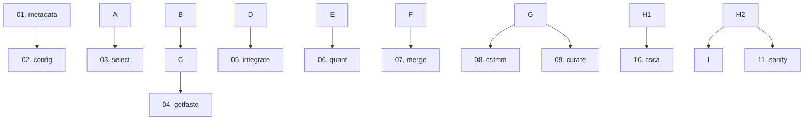

# Amalgkit Steps Documentation - Index

This directory contains comprehensive documentation for all 11 amalgkit workflow steps.

## Quick Links

- [API Reference](../../API.md) - Complete function documentation
- [Function Index](../FUNCTIONS.md) - Quick function lookup
- [Workflow Guide](../../workflow.md) - Workflow planning and execution
- [Main Documentation](../../README.md) - RNA domain master index

## Step Documentation

### 1. metadata - NCBI SRA Metadata Retrieval

**Function Signature**:
```python
def metadata(
    params: AmalgkitParams | None = None,
    **kwargs: Any
) -> subprocess.CompletedProcess[str]

def run_metadata(
    params: Mapping[str, Any] | None = None,
    *,
    work_dir: str | Path | None = None,
    log_dir: str | Path | None = None,
    check: bool = False,
) -> subprocess.CompletedProcess[str]
```

**Documentation**: [01_metadata.md](01_metadata.md) | [API Reference](../../API.md#metadata)

---

### 2. config - Generate Configuration Files

**Function Signature**:
```python
def config(
    params: AmalgkitParams | None = None,
    **kwargs: Any
) -> subprocess.CompletedProcess[str]

def run_config(
    params: Mapping[str, Any] | None = None,
    *,
    work_dir: str | Path | None = None,
    log_dir: str | Path | None = None,
    check: bool = False,
) -> subprocess.CompletedProcess[str]
```

**Documentation**: [02_config.md](02_config.md) | [API Reference](../../API.md#config)

---

### 3. select - Filter SRA Entries by Quality

**Function Signature**:
```python
def select(
    params: AmalgkitParams | None = None,
    **kwargs: Any
) -> subprocess.CompletedProcess[str]

def run_select(
    params: Mapping[str, Any] | None = None,
    *,
    work_dir: str | Path | None = None,
    log_dir: str | Path | None = None,
    check: bool = False,
) -> subprocess.CompletedProcess[str]
```

**Documentation**: [03_select.md](03_select.md) | [API Reference](../../API.md#select)

---

### 4. getfastq - Download and Convert SRA to FASTQ

**Function Signature**:
```python
def getfastq(
    params: AmalgkitParams | None = None,
    **kwargs: Any
) -> subprocess.CompletedProcess[str]

def run_getfastq(
    params: Mapping[str, Any] | None = None,
    *,
    work_dir: str | Path | None = None,
    log_dir: str | Path | None = None,
    check: bool = False,
) -> subprocess.CompletedProcess[str]
```

**Documentation**: [04_getfastq.md](04_getfastq.md) | [API Reference](../../API.md#getfastq)

---

### 5. integrate - Integrate FASTQ Paths into Metadata

**Function Signature**:
```python
def integrate(
    params: AmalgkitParams | None = None,
    **kwargs: Any
) -> subprocess.CompletedProcess[str]

def run_integrate(
    params: Mapping[str, Any] | None = None,
    *,
    work_dir: str | Path | None = None,
    log_dir: str | Path | None = None,
    check: bool = False,
) -> subprocess.CompletedProcess[str]
```

**Documentation**: [05_integrate.md](05_integrate.md) | [API Reference](../../API.md#integrate)

---

### 6. quant - Quantify Transcript Abundances

**Function Signature**:
```python
def quant(
    params: AmalgkitParams | None = None,
    **kwargs: Any
) -> subprocess.CompletedProcess[str]

def run_quant(
    params: Mapping[str, Any] | None = None,
    *,
    work_dir: str | Path | None = None,
    log_dir: str | Path | None = None,
    check: bool = False,
) -> subprocess.CompletedProcess[str]
```

**Documentation**: [06_quant.md](06_quant.md) | [API Reference](../../API.md#quant)

---

### 7. merge - Merge Quantification Results

**Function Signature**:
```python
def merge(
    params: AmalgkitParams | None = None,
    **kwargs: Any
) -> subprocess.CompletedProcess[str]

def run_merge(
    params: Mapping[str, Any] | None = None,
    *,
    work_dir: str | Path | None = None,
    log_dir: str | Path | None = None,
    check: bool = False,
) -> subprocess.CompletedProcess[str]
```

**Documentation**: [07_merge.md](07_merge.md) | [API Reference](../../API.md#merge)

---

### 8. cstmm - Cross-Species TMM Normalization

**Function Signature**:
```python
def cstmm(
    params: AmalgkitParams | None = None,
    **kwargs: Any
) -> subprocess.CompletedProcess[str]

def run_cstmm(
    params: Mapping[str, Any] | None = None,
    *,
    work_dir: str | Path | None = None,
    log_dir: str | Path | None = None,
    check: bool = False,
) -> subprocess.CompletedProcess[str]
```

**Documentation**: [08_cstmm.md](08_cstmm.md) | [API Reference](../../API.md#cstmm)

---

### 9. curate - Quality Control and Batch Correction

**Function Signature**:
```python
def curate(
    params: AmalgkitParams | None = None,
    **kwargs: Any
) -> subprocess.CompletedProcess[str]

def run_curate(
    params: Mapping[str, Any] | None = None,
    *,
    work_dir: str | Path | None = None,
    log_dir: str | Path | None = None,
    check: bool = False,
) -> subprocess.CompletedProcess[str]
```

**Documentation**: [09_curate.md](09_curate.md) | [API Reference](../../API.md#curate)

---

### 10. csca - Cross-Species Correlation Analysis

**Function Signature**:
```python
def csca(
    params: AmalgkitParams | None = None,
    **kwargs: Any
) -> subprocess.CompletedProcess[str]

def run_csca(
    params: Mapping[str, Any] | None = None,
    *,
    work_dir: str | Path | None = None,
    log_dir: str | Path | None = None,
    check: bool = False,
) -> subprocess.CompletedProcess[str]
```

**Documentation**: [10_csca.md](10_csca.md) | [API Reference](../../API.md#csca)

---

### 11. sanity - Validate Workflow Outputs

**Function Signature**:
```python
def sanity(
    params: AmalgkitParams | None = None,
    **kwargs: Any
) -> subprocess.CompletedProcess[str]

def run_sanity(
    params: Mapping[str, Any] | None = None,
    *,
    work_dir: str | Path | None = None,
    log_dir: str | Path | None = None,
    check: bool = False,
) -> subprocess.CompletedProcess[str]
```

**Documentation**: [11_sanity.md](11_sanity.md) | [API Reference](../../API.md#sanity)

## Workflow Order

Standard workflow progression:



## Quick Reference Table

| Step | Function | Required Input | Primary Output | Typical Runtime | Documentation |
|------|----------|----------------|----------------|----------------|---------------|
| **metadata** | `metadata()` | Search string | metadata.tsv | 1-30 min | [01_metadata.md](01_metadata.md) |
| **config** | `config()` | None | .config files | <1 sec | [02_config.md](02_config.md) |
| **select** | `select()` | metadata.tsv, configs | pivot_qualified.tsv | <1 min | [03_select.md](03_select.md) |
| **getfastq** | `getfastq()` | pivot_qualified.tsv | FASTQ files | Hours-days | [04_getfastq.md](04_getfastq.md) |
| **integrate** | `integrate()` | FASTQ dir | Updated metadata | <5 min | [05_integrate.md](05_integrate.md) |
| **quant** | `quant()` | FASTQs, transcriptome | abundance.tsv per sample | 1-10 min/sample | [06_quant.md](06_quant.md) |
| **merge** | `merge()` | All quant outputs | Merged expression matrix | <1 min | [07_merge.md](07_merge.md) |
| **cstmm** | `cstmm()` | Multiple species merge | TMM-normalized matrix | <5 min | [08_cstmm.md](08_cstmm.md) |
| **curate** | `curate()` | Merged matrix | QC'd, corrected matrix + PDFs | 5-30 min | [09_curate.md](09_curate.md) |
| **csca** | `csca()` | Multiple species curate | Cross-species plots | 5-15 min | [10_csca.md](10_csca.md) |
| **sanity** | `sanity()` | All outputs | Validation reports | <1 min | [11_sanity.md](11_sanity.md) |

## Usage Patterns

### Single-Species Workflow

```bash
# Minimal single-species analysis
amalgkit metadata --search_string "..." --out_dir work
amalgkit config --out_dir work
amalgkit select --out_dir work
amalgkit getfastq --out_dir work
amalgkit quant --out_dir work
amalgkit merge --out_dir work
amalgkit curate --out_dir work
amalgkit sanity --out_dir work --all
```

### Multi-Species Comparative Workflow

```bash
# For each species:
amalgkit metadata ... # Species 1
amalgkit metadata ... # Species 2
# ... (config, select, getfastq, quant, merge for each)

# Then cross-species:
amalgkit cstmm --orthogroup_table orthogroups.tsv
amalgkit curate --out_dir multi_species
amalgkit csca --out_dir multi_species
```

## Documentation Standards

Each step documentation includes:

✅ **Purpose** - What the step does  
✅ **Overview** - Key functionality  
✅ **Usage** - CLI, Python API, config examples  
✅ **Parameters** - Complete parameter reference  
✅ **Input Requirements** - Prerequisites and dependencies  
✅ **Output Files** - All generated files with descriptions  
✅ **Workflow Integration** - Position in pipeline  
✅ **Common Use Cases** - Real-world examples  
✅ **Performance Considerations** - Runtime and resource usage  
✅ **Troubleshooting** - Common issues and solutions  
✅ **Best Practices** - Recommended approaches  
✅ **Real-World Examples** - Production use cases  
✅ **Integration with METAINFORMANT** - Python workflow integration  
✅ **References** - External documentation links  
✅ **See Also** - Related documentation

## Python API Integration

All steps are accessible via Python:

```python
from metainformant.rna import amalgkit

# Direct step execution
amalgkit.metadata(out_dir="work", search_string="...")
amalgkit.config(out_dir="work", config="base")
amalgkit.select(out_dir="work")
# ... etc

# Or via workflow orchestration
from metainformant.rna.workflow import execute_workflow, load_workflow_config

cfg = load_workflow_config("config/amalgkit_species.yaml")
execute_workflow(cfg)  # Runs all configured steps in order
```

## Testing Coverage

All steps have comprehensive test coverage:

```bash
# Test all steps
pytest tests/test_rna_amalgkit_steps.py -v

# Test specific step
pytest tests/test_rna_amalgkit_steps.py::test_metadata_basic_execution -v
```

**Test Status**: ✅ 71/71 tests passing (100%)

## Next Steps Navigation

After reading about a step, you might want to:

- **Learn the next step**: Follow the workflow diagram above
- **See function details**: Check [API Reference](../../API.md) for complete signatures
- **Find examples**: See [EXAMPLES.md](../../EXAMPLES.md) for real-world usage
- **Configure workflows**: Read [Configuration Guide](../../CONFIGURATION.md)
- **Run complete pipeline**: See [Workflow Guide](../../workflow.md)

## Related Documentation

- **[API Reference](../../API.md)** - Complete function documentation with signatures
- **[Function Index](../FUNCTIONS.md)** - Quick function lookup table
- **[Pipeline Overview](../amalgkit.md)** - Complete pipeline documentation
- **[Getting Started](../../GETTING_STARTED.md)** - Getting started guide
- **[Testing Coverage](../testing_coverage.md)** - Test coverage report
- **[R Packages](../r_packages.md)** - R package requirements
- **[Main Index](../../README.md)** - RNA domain master index

## Contributing

When adding new step documentation:

1. Follow the established template structure
2. Include all standard sections
3. Add real-world examples from production use
4. Document all parameters from `amalgkit <step> --help`
5. Include troubleshooting for common issues
6. Test all code examples
7. Cross-reference related documentation

## Version Information

- **AMALGKIT Version**: 0.12.20
- **Documentation Date**: October 29, 2025
- **METAINFORMANT RNA Module**: v1.0
- **Status**: ✅ Production-ready, comprehensively tested

---

*For detailed information on each step, click the links above or navigate to the individual step documentation files.*


