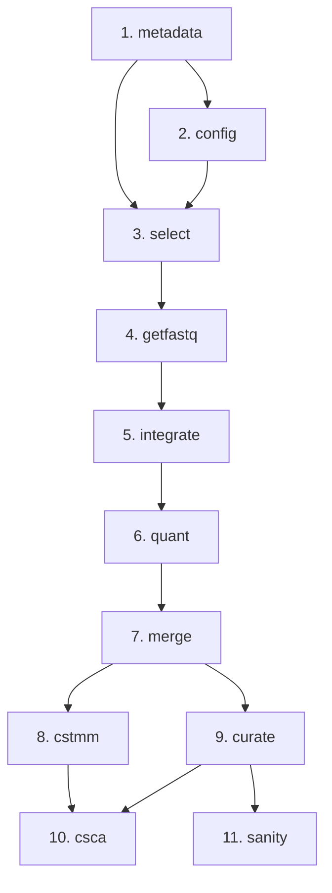

# Amalgkit Steps Documentation - Index

This directory contains comprehensive documentation for all 11 amalgkit workflow steps.

## Complete Step Documentation

1. **[metadata.md](metadata.md)** - NCBI SRA metadata retrieval
2. **[integrate.md](integrate.md)** - Appending local FASTQ info to metadata tables
3. **[config.md](config.md)** - Creating configuration files for metadata selection  
4. **[select.md](select.md)** - Selecting SRA entries for analysis
5. **[getfastq.md](getfastq.md)** - Generating FASTQ files from SRA
6. **[quant.md](quant.md)** - Transcript abundance estimation
7. **[merge.md](merge.md)** - Generating transcript abundance tables
8. **[cstmm.md](cstmm.md)** - Cross-species TMM normalization
9. **[curate.md](curate.md)** - Automatic outlier removal and bias correction
10. **[csca.md](csca.md)** - Cross-species correlation analysis plots
11. **[sanity.md](sanity.md)** - Integrity checking of inputs and outputs

## Workflow Order

Standard workflow progression:



## Quick Reference

| Step | Required Input | Primary Output | Typical Runtime |
|------|----------------|----------------|----------------|
| metadata | Search string | metadata.tsv | 1-30 min |
| integrate | FASTQ dir | Updated metadata | <5 min |
| config | None | .config files | <1 sec |
| select | metadata.tsv, configs | pivot_qualified.tsv | <1 min |
| getfastq | pivot_qualified.tsv | FASTQ files | Hours-days |
| quant | FASTQs, transcriptome | abundance.tsv per sample | 1-10 min/sample |
| merge | All quant outputs | Merged expression matrix | <1 min |
| cstmm | Multiple species merge | TMM-normalized matrix | <5 min |
| curate | Merged matrix | QC'd, corrected matrix + PDFs | 5-30 min |
| csca | Multiple species curate | Cross-species plots | 5-15 min |
| sanity | All outputs | Validation reports | <1 min |

## Usage Patterns

### Single-Species Workflow

```bash
# Minimal single-species analysis
amalgkit metadata --search_string "..." --out_dir work
amalgkit config --out_dir work
amalgkit select --out_dir work
amalgkit getfastq --out_dir work
amalgkit quant --out_dir work
amalgkit merge --out_dir work
amalgkit curate --out_dir work
amalgkit sanity --out_dir work --all
```

### Multi-Species Comparative Workflow

```bash
# For each species:
amalgkit metadata ... # Species 1
amalgkit metadata ... # Species 2
# ... (config, select, getfastq, quant, merge for each)

# Then cross-species:
amalgkit cstmm --orthogroup_table orthogroups.tsv
amalgkit curate --out_dir multi_species
amalgkit csca --out_dir multi_species
```

## Documentation Standards

Each step documentation includes:

✅ **Purpose** - What the step does  
✅ **Overview** - Key functionality  
✅ **Usage** - CLI, Python API, config examples  
✅ **Parameters** - Complete parameter reference  
✅ **Input Requirements** - Prerequisites and dependencies  
✅ **Output Files** - All generated files with descriptions  
✅ **Workflow Integration** - Position in pipeline  
✅ **Common Use Cases** - Real-world examples  
✅ **Performance Considerations** - Runtime and resource usage  
✅ **Troubleshooting** - Common issues and solutions  
✅ **Best Practices** - Recommended approaches  
✅ **Real-World Examples** - Production use cases  
✅ **Integration with METAINFORMANT** - Python workflow integration  
✅ **References** - External documentation links  
✅ **See Also** - Related documentation

## Python API Integration

All steps are accessible via Python:

```python
from metainformant.rna import amalgkit

# Direct step execution
amalgkit.metadata(out_dir="work", search_string="...")
amalgkit.config(out_dir="work", config="base")
amalgkit.select(out_dir="work")
# ... etc

# Or via workflow orchestration
from metainformant.rna.workflow import execute_workflow, load_workflow_config

cfg = load_workflow_config("config/amalgkit_species.yaml")
execute_workflow(cfg)  # Runs all configured steps in order
```

## Testing Coverage

All steps have comprehensive test coverage:

```bash
# Test all steps
pytest tests/test_rna_amalgkit_steps.py -v

# Test specific step
pytest tests/test_rna_amalgkit_steps.py::test_metadata_basic_execution -v
```

**Test Status**: ✅ 71/71 tests passing (100%)

## Related Documentation

- **[../amalgkit.md](../amalgkit.md)** - Complete pipeline overview
- **[../comprehensive_guide.md](../comprehensive_guide.md)** - Comprehensive usage guide
- **[../quick_start.md](../quick_start.md)** - Quick start guide
- **[../testing_coverage.md](../testing_coverage.md)** - Test coverage report
- **[../r_packages.md](../r_packages.md)** - R package requirements
- **[../README.md](../README.md)** - Documentation index

## Contributing

When adding new step documentation:

1. Follow the established template structure
2. Include all standard sections
3. Add real-world examples from production use
4. Document all parameters from `amalgkit <step> --help`
5. Include troubleshooting for common issues
6. Test all code examples
7. Cross-reference related documentation

## Version Information

- **AMALGKIT Version**: 0.12.19
- **Documentation Date**: October 29, 2025
- **METAINFORMANT RNA Module**: v1.0
- **Status**: ✅ Production-ready, comprehensively tested

---

*For detailed information on each step, click the links above or navigate to the individual step documentation files.*


