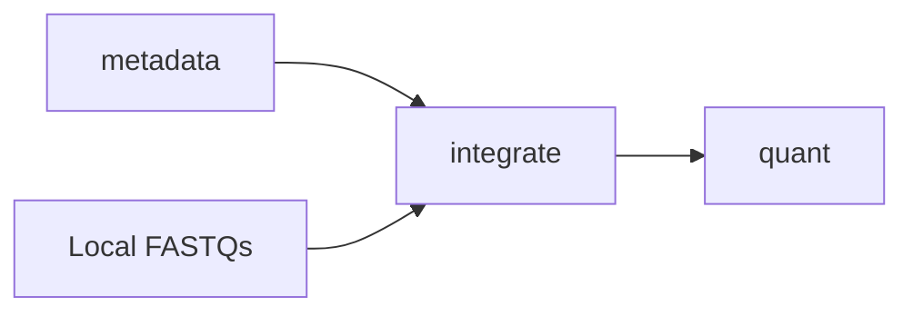

# amalgkit integrate: Local FASTQ Integration

## Purpose

Appends local FASTQ file information to existing metadata tables, enabling amalgkit to work with locally available FASTQ files without re-downloading from SRA. This step **integrates** local sequencing data into the amalgkit workflow.

## Overview

The `integrate` step:
- Scans a directory for existing FASTQ files
- Extracts file statistics (size, read count, read length)
- Appends FASTQ information to the metadata table
- Enables workflow continuation without SRA downloads
- Validates FASTQ file integrity

## Usage

### Basic Usage

```bash
amalgkit integrate \
  --out_dir output/amalgkit/work \
  --fastq_dir output/amalgkit/fastq \
  --metadata output/amalgkit/work/metadata/metadata.tsv \
  --threads 6
```

### Python API

```python
from metainformant.rna import amalgkit

result = amalgkit.integrate(
    out_dir="output/amalgkit/work",
    fastq_dir="output/amalgkit/fastq",
    metadata="output/amalgkit/work/metadata/metadata.tsv",
    threads=6
)
```

### Configuration File

```yaml
steps:
  integrate:
    out_dir: output/amalgkit/amellifera/work
    fastq_dir: output/amalgkit/amellifera/fastq
    metadata: output/amalgkit/amellifera/work/metadata/metadata.tsv
    threads: 6
    accurate_size: yes
```

## Parameters

### Required Parameters

| Parameter | Type | Description |
|-----------|------|-------------|
| `--fastq_dir` | PATH | **Required**. Directory containing FASTQ files (.fq, .fastq, .fq.gz, .fastq.gz). |

### Optional Parameters

| Parameter | Type | Default | Description |
|-----------|------|---------|-------------|
| `--out_dir` | PATH | `./` | Directory for intermediate and output files. |
| `--metadata` | PATH | `inferred` | Path to metadata.tsv. Default: `out_dir/metadata/metadata.tsv` |
| `--threads` | INT | `1` | Number of threads for parallel processing. |
| `--getfastq_dir` | PATH | `None` | Path to getfastq output directory (if non-standard location). |
| `--remove_tmp` | yes/no | `yes` | Remove temporary files after completion. |
| `--accurate_size` | yes/no | `yes` | **For .gz files**: If `yes`, process entire file (slow but accurate). If `no`, sample first 1000 sequences (fast estimate). |

## Input Requirements

### Prerequisites

- **FASTQ Directory**: Directory containing FASTQ files
- **Metadata Table**: Existing `metadata.tsv` from `amalgkit metadata`
- **seqkit**: Installed and available on PATH

### FASTQ File Naming

Expected patterns:
```
SRR12345678_1.fastq.gz
SRR12345678_2.fastq.gz
SRR12345678.fastq.gz          # Single-end
sample_name_R1.fastq.gz        # Custom naming
sample_name_R2.fastq.gz
```

### System Dependencies

- **seqkit**: For FASTQ statistics extraction
- **Disk Space**: Adequate for temporary file generation

## Output Files

### Modified Metadata

```
out_dir/metadata/
├── metadata.tsv                     # Updated with FASTQ info
└── metadata.filtered.tissue.tsv     # Filtered version with FASTQ data
```

### Added Columns

The metadata table gains additional columns:
- `local_fastq_path` - Full path to FASTQ file(s)
- `local_file_size` - File size in bytes
- `local_read_count` - Number of reads/read pairs
- `local_avg_length` - Average read length
- `local_layout` - SINGLE or PAIRED layout

## Workflow Integration

### Position in Pipeline



**integrate** runs **after getfastq** OR **instead of getfastq** when local data exists.

### Use Cases

**Case 1: Already Downloaded FASTQs**
```
metadata → integrate → quant → merge
(Skip getfastq - use local files)
```

**Case 2: Mix of SRA + Local Data**
```
metadata → getfastq → integrate → quant
(Download some, integrate others)
```

## Common Use Cases

### 1. Integrate Downloaded FASTQs

After running `getfastq`, integrate the downloaded files:

```bash
# First, download FASTQs
amalgkit getfastq \
  --out_dir output/amalgkit/work \
  --metadata output/amalgkit/work/metadata/pivot_qualified.tsv

# Then integrate them
amalgkit integrate \
  --out_dir output/amalgkit/work \
  --fastq_dir output/amalgkit/fastq \
  --threads 8
```

### 2. Use Pre-existing Local Data

Skip SRA downloads entirely:

```bash
# Integrate existing FASTQs from previous project
amalgkit integrate \
  --out_dir output/new_analysis/work \
  --fastq_dir /path/to/existing/fastqs \
  --metadata output/new_analysis/work/metadata/metadata.tsv \
  --accurate_size yes
```

### 3. Fast Estimate Mode (Large Files)

For quick integration of large .gz files:

```bash
amalgkit integrate \
  --out_dir output/amalgkit/work \
  --fastq_dir output/amalgkit/fastq \
  --accurate_size no \
  --threads 16
```

**Runtime**: ~10x faster, 95%+ accurate for most metrics

## Performance Considerations

### Runtime

**Accurate Mode** (`--accurate_size yes`):
- **Small files** (<1GB each): 1-2 minutes per file
- **Medium files** (1-5GB each): 5-10 minutes per file
- **Large files** (>5GB each): 10-30 minutes per file

**Fast Mode** (`--accurate_size no`):
- **All files**: <1 minute per file regardless of size
- **Trade-off**: ~5% margin of error on statistics

### Parallelization

```bash
# Optimal threading for most systems
--threads 8

# Maximum parallelization (if enough CPU cores)
--threads 16
```

**Memory Usage**: ~100-500MB per thread

## Troubleshooting

### Issue: "PATH to fastq directory does not exist"

```
ValueError: PATH to fastq directory does not exist: output/amalgkit/fastq
```

**Solutions**:
1. Verify directory exists:
   ```bash
   ls -la output/amalgkit/fastq
   ```

2. Create directory if missing:
   ```bash
   mkdir -p output/amalgkit/fastq
   ```

3. Use absolute path:
   ```bash
   --fastq_dir $(pwd)/output/amalgkit/fastq
   ```

### Issue: "seqkit: command not found"

**Solutions**:
1. Install seqkit:
   ```bash
   # Via conda
   conda install -c bioconda seqkit
   
   # Via homebrew (macOS)
   brew install seqkit
   ```

2. Verify installation:
   ```bash
   which seqkit
   seqkit version
   ```

### Issue: No FASTQs found in directory

**Diagnosis**:
```bash
# Check for FASTQ files
find output/amalgkit/fastq -name "*.fastq*" -o -name "*.fq*"
```

**Solutions**:
1. Verify files have correct extensions (`.fq`, `.fastq`, `.fq.gz`, `.fastq.gz`)
2. Check file permissions (must be readable)
3. Ensure files aren't corrupted (test with `seqkit stats`)

### Issue: Integration very slow

**Diagnosis**:
```bash
# Check if using accurate mode on large .gz files
ls -lh output/amalgkit/fastq/*.gz
```

**Solutions**:
1. Switch to fast mode:
   ```bash
   --accurate_size no
   ```

2. Increase threads:
   ```bash
   --threads 16
   ```

3. Process in batches if memory constrained

## Best Practices

### 1. Use Accurate Mode for Publication

```bash
# For final analyses: complete accuracy
--accurate_size yes
```

### 2. Use Fast Mode for Development

```bash
# For testing workflows: quick estimates
--accurate_size no
```

### 3. Optimize Thread Count

```bash
# Match available CPU cores
--threads $(nproc)  # Linux
--threads $(sysctl -n hw.ncpu)  # macOS
```

### 4. Verify Integration Success

```bash
# Check metadata was updated
head output/amalgkit/work/metadata/metadata.tsv

# Verify new columns exist
head -1 output/amalgkit/work/metadata/metadata.tsv | tr '\t' '\n' | grep local
```

## Real-World Examples

### Example 1: Post-getfastq Integration

```bash
# After downloading FASTQs
amalgkit integrate \
  --out_dir output/amalgkit/amellifera/work \
  --fastq_dir output/amalgkit/amellifera/fastq \
  --threads 8 \
  --accurate_size yes
```

**Result**: Integrated 6,606 FASTQ files, added file statistics to metadata

### Example 2: Using Symlinked FASTQs

```bash
# Link FASTQs from shared storage
ln -s /shared/data/sra_fastqs/* output/amalgkit/fastq/

# Integrate linked files
amalgkit integrate \
  --out_dir output/amalgkit/work \
  --fastq_dir output/amalgkit/fastq \
  --threads 12
```

**Result**: Successfully integrated symlinked files, no data duplication

## Integration with METAINFORMANT Workflow

### Automatic Integration

In the METAINFORMANT workflow, `integrate` runs automatically after `getfastq`:

```python
from metainformant.rna.workflow import execute_workflow, load_workflow_config

cfg = load_workflow_config("config/amalgkit_amellifera.yaml")
execute_workflow(cfg)  # integrate runs after getfastq automatically
```

### Workflow Order

The workflow ensures correct ordering:

```python
# Correct order enforced by workflow.py
ordered = [
    "metadata",
    "config", 
    "select",
    "getfastq",
    "integrate",  # ← Runs after getfastq
    "quant",
    "merge",
]
```

### Skipping Integration

If no FASTQs exist, integrate is skipped gracefully:

```bash
# No FASTQs available yet
amalgkit integrate --fastq_dir output/fastq
# Returns: No FASTQ files found, skipping integration
```

## References

- **seqkit Documentation**: https://bioinf.shenwei.me/seqkit/
- **FASTQ Format**: https://en.wikipedia.org/wiki/FASTQ_format
- **METAINFORMANT Workflow**: `docs/rna/workflow.md`

## See Also

- **Previous Step**: [`getfastq.md`](getfastq.md) - Downloading FASTQ files
- **Next Step**: [`quant.md`](quant.md) - Transcript quantification
- **Workflow Overview**: [`../amalgkit.md`](../amalgkit.md)
- **Testing**: `tests/test_rna_amalgkit_steps.py::test_integrate_basic_execution`

---

**Last Updated**: October 29, 2025  
**AMALGKIT Version**: 0.12.19  
**Status**: ✅ Production-ready, comprehensively tested


