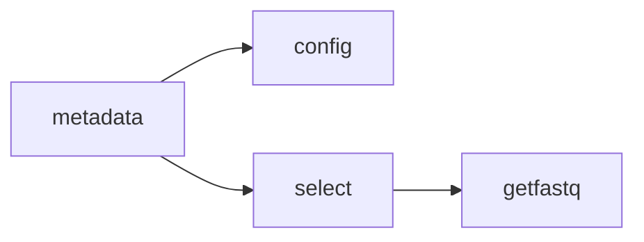

# amalgkit metadata: NCBI SRA Metadata Retrieval

## Purpose

Queries NCBI SRA database using Entrez search to discover and retrieve metadata for RNA-seq samples. This is the **first step** in the amalgkit workflow, identifying available datasets for downstream analysis.

## Overview

The `metadata` step:
- Searches NCBI SRA database using custom Entrez queries
- Retrieves comprehensive metadata for matching samples
- Generates standardized metadata tables for downstream processing
- Supports species-specific and platform-specific filtering

## Usage

### Basic Usage

```bash
amalgkit metadata \
  --out_dir output/amalgkit/work \
  --search_string '"Apis mellifera"[Organism] AND RNA-Seq[Strategy] AND Illumina[Platform]' \
  --entrez_email your.email@example.com
```

### Python API

```python
from metainformant.rna import amalgkit

result = amalgkit.metadata(
    out_dir="output/amalgkit/work",
    search_string='"Apis mellifera"[Organism] AND RNA-Seq[Strategy] AND Illumina[Platform]',
    entrez_email="your.email@example.com"
)
```

### Configuration File

```yaml
steps:
  metadata:
    out_dir: output/amalgkit/amellifera/work
    search_string: '"Apis mellifera"[Organism] AND RNA-Seq[Strategy] AND Illumina[Platform]'
    entrez_email: your.email@example.com
    redo: yes
```

## Parameters

### Required Parameters

| Parameter | Type | Description |
|-----------|------|-------------|
| `--search_string` | PATH/STR | **Required**. Entrez search string to identify SRA entries. See [NCBI E-utilities documentation](https://www.ncbi.nlm.nih.gov/books/NBK25499/) for syntax. |

### Optional Parameters

| Parameter | Type | Default | Description |
|-----------|------|---------|-------------|
| `--out_dir` | PATH | `./` | Directory where intermediate and output files are generated. |
| `--redo` | yes/no | `no` | Force re-analysis even if previous output files exist. Use `yes` to fetch latest data. |
| `--entrez_email` | email | `` | Your email address for NCBI Entrez API (recommended for rate limiting). |

## Search String Examples

### Species-Specific Searches

```bash
# Honey bee RNA-seq data
--search_string '"Apis mellifera"[Organism] AND RNA-Seq[Strategy] AND Illumina[Platform]'

# Red harvester ant
--search_string '"Pogonomyrmex barbatus"[Organism] AND RNA-Seq[Strategy] AND Illumina[Platform]'

# Human samples
--search_string '"Homo sapiens"[Organism] AND RNA-Seq[Strategy]'
```

### Advanced Filtering

```bash
# Specific tissue type
--search_string '"Apis mellifera"[Organism] AND RNA-Seq[Strategy] AND brain[Title]'

# Date-restricted search
--search_string '"Apis mellifera"[Organism] AND RNA-Seq[Strategy] AND 2020:2025[Publication Date]'

# Paired-end only
--search_string '"Apis mellifera"[Organism] AND RNA-Seq[Strategy] AND paired[Layout]'
```

## Input Requirements

### Prerequisites

- **Network Access**: Active internet connection to NCBI servers
- **Email (Recommended)**: For NCBI rate limiting compliance
- **Search String**: Valid Entrez search query

### System Dependencies

- Python packages: `biopython` (for Entrez API)
- Network: HTTPS access to `eutils.ncbi.nlm.nih.gov`

## Output Files

### Primary Output

```
out_dir/metadata/
└── metadata.tsv
```

**`metadata.tsv`**: Tab-delimited table with columns:
- `Run` - SRA run accession (e.g., SRR12345678)
- `ReleaseDate` - Public release date
- `LoadDate` - Database load date
- `spots` - Number of spots (read pairs/reads)
- `bases` - Total base count
- `spots_with_mates` - Paired-end spots
- `avgLength` - Average read length
- `size_MB` - File size in megabytes
- `download_path` - SRA download URL
- `Experiment` - SRA experiment accession
- `LibraryName` - Library identifier
- `LibraryStrategy` - Sequencing strategy (RNA-Seq)
- `LibrarySelection` - Selection method
- `LibrarySource` - Source type (TRANSCRIPTOMIC)
- `LibraryLayout` - SINGLE or PAIRED
- `InsertSize` - Insert size (paired-end)
- `InsertDev` - Insert size std deviation
- `Platform` - Sequencing platform (ILLUMINA)
- `Model` - Instrument model
- `SRAStudy` - Study accession
- `BioProject` - BioProject ID
- `Study_Pubmed_id` - PubMed ID
- `ProjectID` - NCBI Project ID
- `Sample` - Sample accession
- `BioSample` - BioSample ID
- `SampleType` - Sample type
- `TaxID` - NCBI Taxonomy ID
- `ScientificName` - Species scientific name
- `SampleName` - Sample name
- `g1k_pop_code` - Population code (if applicable)
- `source` - Sample source
- `g1k_analysis_group` - Analysis group
- `Subject_ID` - Subject identifier
- `Sex` - Biological sex
- `Disease` - Disease status
- `Tumor` - Tumor indicator
- `Affection_Status` - Phenotype status
- `Analyte_Type` - Analyte type
- `Histological_Type` - Tissue histology
- `Body_Site` - Anatomical site
- `CenterName` - Sequencing center
- `Submission` - Submission accession
- `dbgap_study_accession` - dbGaP study ID
- `Consent` - Data use consent
- `RunHash` - Run hash
- `ReadHash` - Read hash

### Additional Files

```
out_dir/metadata/
├── metadata.tsv                    # Primary output
├── metadata.filtered.tissue.tsv    # Tissue-filtered (if filters applied)
└── metadata_original.tsv           # Backup of original query results
```

## Common Use Cases

### 1. Initial Species Discovery

```bash
# Find all available RNA-seq data for a species
amalgkit metadata \
  --out_dir output/discovery \
  --search_string '"Camponotus floridanus"[Organism] AND RNA-Seq[Strategy]' \
  --entrez_email your.email@example.com
```

**Expected Outcome**: Discovers all public RNA-seq datasets for the species.

### 2. Tissue-Specific Analysis

```bash
# Target specific tissues
amalgkit metadata \
  --out_dir output/brain_analysis \
  --search_string '"Apis mellifera"[Organism] AND RNA-Seq[Strategy] AND (brain[Title] OR head[Title])' \
  --entrez_email your.email@example.com
```

**Expected Outcome**: Retrieves metadata for brain/head-specific samples only.

### 3. Update Existing Metadata

```bash
# Force refresh to get latest uploads
amalgkit metadata \
  --out_dir output/amalgkit/work \
  --search_string '"Species name"[Organism] AND RNA-Seq[Strategy]' \
  --redo yes \
  --entrez_email your.email@example.com
```

**Expected Outcome**: Downloads fresh metadata, replacing cached results.

## Workflow Integration

### Position in Pipeline



**metadata** is always the **first step** in the workflow.

### Downstream Dependencies

| Step | Dependency | Description |
|------|------------|-------------|
| `config` | `metadata.tsv` | Uses species list to generate config files |
| `select` | `metadata.tsv` | Filters samples based on quality metrics |
| `integrate` | `metadata.tsv` | Merges local FASTQ info into metadata |
| `getfastq` | `metadata.tsv` (via select) | Downloads SRA files listed in metadata |

## Performance Considerations

### Runtime

- **Small queries** (<100 samples): 10-30 seconds
- **Medium queries** (100-1000 samples): 1-5 minutes
- **Large queries** (1000-10000 samples): 5-30 minutes
- **Very large queries** (>10000 samples): May require NCBI rate limiting handling

### Rate Limiting

NCBI enforces request rate limits:
- **Without email**: 3 requests/second
- **With email**: 10 requests/second
- **Recommendation**: Always provide `--entrez_email`

### Caching Behavior

When `--redo no` (default):
- Checks for existing `metadata.tsv`
- Skips download if file exists
- **Fast re-runs**: <1 second

When `--redo yes`:
- Always downloads fresh data
- Overwrites existing metadata
- **Use for**: Getting latest submissions

## Troubleshooting

### Issue: No samples found

```bash
# Error: Search returns zero results
```

**Diagnosis**:
```bash
# Test search at NCBI web interface
# Visit: https://www.ncbi.nlm.nih.gov/sra/
# Paste your search string
```

**Solutions**:
1. Verify species name spelling (use NCBI taxonomy)
2. Check for available RNA-seq data on NCBI SRA
3. Broaden search criteria (remove filters)
4. Try alternative search terms

### Issue: NCBI connection timeout

```
urllib.error.URLError: <urlopen error [Errno 60] Operation timed out>
```

**Solutions**:
1. Check internet connectivity
2. Retry with `--redo yes`
3. Verify firewall settings allow HTTPS to `eutils.ncbi.nlm.nih.gov`
4. Try at different time (NCBI maintenance windows)

### Issue: Rate limiting error

```
HTTP Error 429: Too Many Requests
```

**Solutions**:
1. Add `--entrez_email` parameter
2. Reduce query complexity
3. Wait 1 minute and retry
4. Break into smaller date-range queries

### Issue: Empty metadata.tsv generated

**Diagnosis**:
```bash
# Check file size
wc -l out_dir/metadata/metadata.tsv
# Should show > 1 (header + data rows)
```

**Solutions**:
1. Verify search string returns results on NCBI web interface
2. Check for API access issues (test with simple query)
3. Inspect stderr logs for Entrez errors
4. Try with `--redo yes` to force refresh

## Best Practices

### 1. Always Provide Email

```bash
# Good: Enables higher rate limits
--entrez_email your.email@example.com

# Bad: Subject to strict rate limiting
# (no email parameter)
```

### 2. Use Specific Searches

```bash
# Good: Precise, fast queries
--search_string '"Apis mellifera"[Organism] AND RNA-Seq[Strategy] AND Illumina[Platform]'

# Less optimal: Very broad, slow queries
--search_string 'RNA-Seq[Strategy]'
```

### 3. Enable Redo for Fresh Data

```bash
# For production runs: get latest data
--redo yes

# For development/testing: use cached
--redo no
```

### 4. Validate Metadata After Download

```bash
# Check sample count
wc -l output/amalgkit/work/metadata/metadata.tsv

# Inspect first few samples
head -20 output/amalgkit/work/metadata/metadata.tsv

# Check for specific columns
head -1 output/amalgkit/work/metadata/metadata.tsv | tr '\t' '\n'
```

## Real-World Examples

### Example 1: Apis mellifera (Honey Bee)

```bash
amalgkit metadata \
  --out_dir output/amalgkit/amellifera/work \
  --search_string '"Apis mellifera"[Organism] AND RNA-Seq[Strategy] AND Illumina[Platform]' \
  --entrez_email research@example.com \
  --redo yes
```

**Result**: Retrieved 6,606 samples (as of Oct 2025)

### Example 2: Pogonomyrmex barbatus (Red Harvester Ant)

```bash
amalgkit metadata \
  --out_dir output/amalgkit/pbarbatus/work \
  --search_string '"Pogonomyrmex barbatus"[Organism] AND RNA-Seq[Strategy]' \
  --entrez_email research@example.com
```

**Result**: Retrieved 120 samples, filtered to 83 brain samples

### Example 3: Multi-Species Comparative

```python
from metainformant.rna import amalgkit

species_list = [
    "Apis mellifera",
    "Bombus terrestris",
    "Bombus impatiens"
]

for species in species_list:
    search = f'"{species}"[Organism] AND RNA-Seq[Strategy] AND Illumina[Platform]'
    amalgkit.metadata(
        out_dir=f"output/amalgkit/{species.replace(' ', '_').lower()}/work",
        search_string=search,
        entrez_email="research@example.com"
    )
```

**Result**: Retrieves metadata for 3 bee species for comparative analysis.

## Integration with METAINFORMANT Workflow

### Automatic Metadata Handling

```python
from metainformant.rna.workflow import load_workflow_config, execute_workflow

# Load configuration
cfg = load_workflow_config("config/amalgkit_amellifera.yaml")

# Execute metadata step (automatic in workflow)
result = execute_workflow(cfg, steps_to_run=["metadata"])

# Metadata automatically available for downstream steps
```

### Metadata Filtering in Workflow

The workflow automatically applies filters after metadata retrieval:

```yaml
# config/amalgkit_amellifera.yaml
filters:
  require_tissue: true           # Only samples with tissue annotations
  min_spots: 10000000           # Minimum 10M reads
  library_layout: PAIRED         # Paired-end only
  platform: Illumina            # Illumina platform only
```

## References

- **NCBI E-utilities**: https://www.ncbi.nlm.nih.gov/books/NBK25499/
- **SRA Database**: https://www.ncbi.nlm.nih.gov/sra/
- **Entrez Search Examples**: https://www.ncbi.nlm.nih.gov/books/NBK3837/
- **METAINFORMANT RNA Workflow**: `docs/rna/workflow.md`

## See Also

- **Next Step**: [`config.md`](config.md) - Generating config files for selection
- **Next Step**: [`select.md`](select.md) - Filtering samples for analysis  
- **Workflow Overview**: [`../amalgkit.md`](../amalgkit.md)
- **Testing**: `tests/test_rna_amalgkit_steps.py::test_metadata_basic_execution`

---

**Last Updated**: October 29, 2025  
**AMALGKIT Version**: 0.12.19  
**Status**: ✅ Production-ready, comprehensively tested


