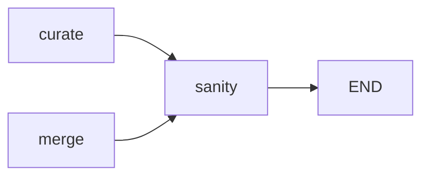

# amalgkit sanity: Integrity Checking of Inputs and Outputs

## Purpose

Validates the integrity of amalgkit workflow inputs and outputs, ensuring all samples have required files for downstream analysis. This step performs **quality assurance** checks on the complete workflow.

## Overview

The `sanity` step:
- Verifies kallisto indices exist for all species
- Verifies FASTQ files were downloaded (if needed)
- Checks that quantification files exist for all samples
- Identifies missing or incomplete samples
- Generates validation reports

## Usage

### Basic Usage

```bash
# Check everything
amalgkit sanity \
  --out_dir output/amalgkit/work \
  --all
```

### Individual Checks

```bash
# Check indices only
amalgkit sanity \
  --out_dir output/amalgkit/work \
  --index

# Check quant outputs only
amalgkit sanity \
  --out_dir output/amalgkit/work \
  --quant

# Check FASTQ files only
amalgkit sanity \
  --out_dir output/amalgkit/work \
  --getfastq
```

### Python API

```python
from metainformant.rna import amalgkit

result = amalgkit.sanity(
    out_dir="output/amalgkit/work",
    all=True  # Check all: index, quant, getfastq
)
```

### Configuration File

```yaml
steps:
  sanity:
    out_dir: output/amalgkit/amellifera/work
    all: yes
```

## Parameters

### Optional Parameters

| Parameter | Type | Default | Description |
|-----------|------|---------|-------------|
| `--out_dir` | PATH | `./` | Directory for intermediate and output files. |
| `--metadata` | PATH | `inferred` | Path to metadata.tsv. Default: `out_dir/metadata/metadata.tsv` |
| `--index` | FLAG | `False` | Check for availability of kallisto index files. |
| `--quant` | FLAG | `False` | Check for availability of quant output files. |
| `--getfastq` | FLAG | `False` | Check for availability of FASTQ files. |
| `--all` | FLAG | `False` | Run all checks (equivalent to `--index --quant --getfastq`). |
| `--index_dir` | PATH | `None` | Path to index directory. Default: `out_dir/index/` |
| `--quant_dir` | PATH | `None` | Path to quant directory. Default: `out_dir/quant/` |
| `--getfastq_dir` | PATH | `None` | Path to getfastq directory. Default: `out_dir/getfastq/` |

## Input Requirements

### Prerequisites

- **Metadata Table**: To identify which samples/species should exist
- **Workflow Outputs**: To validate (indices, quant files, FASTQs)

### What Gets Checked

**With `--index`**:
- Checks for kallisto index files matching species names in metadata
- Index files expected: `{Scientific_Name}_transcripts.idx`

**With `--quant`**:
- Checks for `abundance.tsv` files in `quant/SRR*/` directories
- Verifies all SRA IDs in metadata have quantification outputs

**With `--getfastq`**:
- Checks for FASTQ files in `getfastq/SRR*/` directories
- **Note**: FASTQs may be deleted after quant (normal), so this check may report missing files even if quant succeeded

## Output Files

### Directory Structure

```
out_dir/sanity/
├── SRA_IDs_without_index.txt      # Species missing indices (if --index)
├── SRA_IDs_without_fastq.txt       # Samples missing FASTQs (if --getfastq)
└── SRA_IDs_without_quant.txt       # Samples missing quant outputs (if --quant)
```

### File Contents

**`SRA_IDs_without_quant.txt`** (CRITICAL):
```
SRR12345678
SRR12345679
SRR12345680
```
**Meaning**: These samples failed quantification and need attention.

**`SRA_IDs_without_fastq.txt`**:
```
SRR12345678
SRR12345679
```
**Meaning**: FASTQ files missing (may be normal if deleted after quant).

**`SRA_IDs_without_index.txt`**:
```
Apis_mellifera
Pogonomyrmex_barbatus
```
**Meaning**: Kallisto indices missing for these species.

## Workflow Integration

### Position in Pipeline



**sanity** is typically the **final step** in the workflow, validating everything.

### When to Run

**Option 1: Final Validation** (Recommended)
```bash
# After completing entire workflow
amalgkit sanity --out_dir output/work --all
```

**Option 2: Intermediate Checks**
```bash
# After quant, before merge
amalgkit sanity --out_dir output/work --quant
```

**Option 3: Continuous Validation**
```bash
# After each major step
amalgkit quant ...
amalgkit sanity --quant  # Verify quant succeeded
```

## Common Use Cases

### 1. Complete Workflow Validation

```bash
# Validate entire workflow
amalgkit sanity \
  --out_dir output/amalgkit/amellifera/work \
  --all
```

**Expected Output**:
- `SRA_IDs_without_quant.txt`: Should be empty (all samples quantified)
- `SRA_IDs_without_fastq.txt`: May have entries (FASTQs deleted after quant)
- `SRA_IDs_without_index.txt`: Should be empty (indices built)

### 2. Verify Quantification Completion

```bash
# Check if all samples were quantified
amalgkit sanity \
  --out_dir output/amalgkit/work \
  --quant
```

**Exit Code**:
- `0`: All samples have quant outputs ✅
- `1`: Some samples missing quant outputs ⚠️

### 3. Identify Failed Downloads

```bash
# Check for missing FASTQs (may indicate download failures)
amalgkit sanity \
  --out_dir output/amalgkit/work \
  --getfastq
```

**Use Case**: Identify samples that failed during `getfastq` step.

### 4. Verify Index Availability

```bash
# Check indices are ready for quantification
amalgkit sanity \
  --out_dir output/amalgkit/work \
  --index
```

**Before quant step**: Ensures indices exist for all species.

## Performance Considerations

### Runtime

- **Index check**: <1 second
- **Quant check**: <1 second (up to 10,000+ samples)
- **FASTQ check**: 1-5 seconds (depends on # samples)
- **All checks**: <5 seconds total

### Resource Usage

- Minimal: File system operations only
- No computation or memory intensive operations

## Troubleshooting

### Issue: Many samples without quant

```
# SRA_IDs_without_quant.txt contains many entries
wc -l output/work/sanity/SRA_IDs_without_quant.txt
# Shows: 50 (50 samples failed)
```

**Causes**:
1. Quant step failed for some samples
2. Quant step not run yet
3. Samples excluded after curate step

**Solutions**:
1. Check quant logs:
   ```bash
   find output/work/quant -name "*.log" -exec grep -l "error" {} \;
   ```

2. Re-quantify missing samples:
   ```bash
   # Create metadata with only missing samples
   grep -f output/work/sanity/SRA_IDs_without_quant.txt \
     output/work/metadata/pivot_qualified.tsv > missing_samples.tsv
   
   amalgkit quant --metadata missing_samples.tsv --out_dir output/work
   ```

3. Verify FASTQs exist for missing samples:
   ```bash
   # Check if FASTQs were deleted
   for srr in $(cat output/work/sanity/SRA_IDs_without_quant.txt); do
       if [ -d "output/work/getfastq/$srr" ]; then
           echo "$srr: FASTQ exists, quant may have failed"
       else
           echo "$srr: FASTQ missing, re-download needed"
       fi
   done
   ```

### Issue: Missing indices

```
# SRA_IDs_without_index.txt shows species without indices
cat output/work/sanity/SRA_IDs_without_index.txt
```

**Solutions**:
1. Build indices:
   ```bash
   amalgkit quant \
     --out_dir output/work \
     --build_index yes \
     --fasta_dir output/work/fasta
   ```

2. Download pre-built indices and place in correct location:
   ```bash
   cp Species_transcripts.idx output/work/index/
   ```

### Issue: FASTQs missing (expected behavior)

**Important**: Missing FASTQs after quant is **NORMAL** if `--clean_fastq yes` was used.

**Explanation**:
```bash
# During quant step:
--clean_fastq yes  # Deletes FASTQs after successful quantification

# Result:
amalgkit sanity --getfastq
# Will report missing FASTQs, but this is expected!
```

**Verification**:
```bash
# Check if quant outputs exist instead
amalgkit sanity --quant
# If no missing quant files: FASTQ deletion was intentional ✅
```

## Best Practices

### 1. Always Run Sanity After Workflow

```bash
# Complete workflow
amalgkit metadata ...
amalgkit select ...
amalgkit getfastq ...
amalgkit quant ...
amalgkit merge ...

# Validate everything
amalgkit sanity --all --out_dir output/work
```

### 2. Check Sanity Exit Code

```bash
# In scripts
amalgkit sanity --all --out_dir output/work
if [ $? -ne 0 ]; then
    echo "Sanity check failed! Check SRA_IDs_without_*.txt files"
    exit 1
fi
```

### 3. Review Sanity Reports

```bash
# Check what's missing
for file in output/work/sanity/SRA_IDs_without_*.txt; do
    count=$(wc -l < "$file")
    if [ "$count" -gt 0 ]; then
        echo "WARNING: $(basename $file) has $count entries"
        head -10 "$file"
    fi
done
```

### 4. Use Sanity for Debugging

```bash
# After getfastq
amalgkit sanity --getfastq --out_dir output/work
# Identify which downloads failed

# After quant
amalgkit sanity --quant --out_dir output/work
# Identify which quantifications failed

# Before merge
amalgkit sanity --quant --out_dir output/work
# Ensure all samples quantified before merging
```

## Real-World Examples

### Example 1: Standard Validation

```bash
# After completing Apis mellifera workflow
amalgkit sanity \
  --out_dir output/amalgkit/amellifera/work \
  --all
```

**Expected Result**:
```
Quant outputs found for all SRA IDs in metadata
amalgkit sanity: end
Exit code: 0
```

**Files Generated**:
- `SRA_IDs_without_quant.txt`: Empty or non-existent ✅
- `SRA_IDs_without_fastq.txt`: May list samples (FASTQs cleaned after quant)
- `SRA_IDs_without_index.txt`: Empty ✅

### Example 2: Identifying Failed Quantifications

```bash
# Check quant status
amalgkit sanity --quant --out_dir output/work

# If failures detected:
cat output/work/sanity/SRA_IDs_without_quant.txt

# Re-quantify failed samples
while read srr; do
    echo "Re-quantifying $srr..."
    amalgkit quant \
      --out_dir output/work \
      --id "$srr" \
      --threads 8
done < output/work/sanity/SRA_IDs_without_quant.txt

# Re-validate
amalgkit sanity --quant --out_dir output/work
```

### Example 3: Multi-Species Validation

```bash
# Validate all species
for species in amellifera pbarbatus cfloridanus; do
    echo "Validating $species..."
    amalgkit sanity \
      --out_dir output/amalgkit/${species}/work \
      --all
    
    if [ $? -eq 0 ]; then
        echo "$species: ✅ All checks passed"
    else
        echo "$species: ⚠️ Some checks failed"
    fi
done
```

## Integration with METAINFORMANT Workflow

### Automatic Validation

```python
from metainformant.rna.workflow import execute_workflow, load_workflow_config

cfg = load_workflow_config("config/amalgkit_amellifera.yaml")
execute_workflow(cfg)  # sanity runs automatically after curate
```

### Workflow Configuration

```yaml
steps:
  sanity:
    all: yes
```

### Accessing Sanity Results

```python
from pathlib import Path

work_dir = Path("output/amalgkit/amellifera/work")
sanity_dir = work_dir / "sanity"

# Check for missing quant files
missing_quant = sanity_dir / "SRA_IDs_without_quant.txt"
if missing_quant.exists():
    with open(missing_quant) as f:
        missing_samples = [line.strip() for line in f if line.strip()]
    
    if missing_samples:
        print(f"WARNING: {len(missing_samples)} samples missing quant outputs")
        print(f"Samples: {', '.join(missing_samples)}")
    else:
        print("✅ All samples have quant outputs")
else:
    print("✅ No missing quant files reported")
```

## Exit Codes

| Exit Code | Meaning |
|-----------|---------|
| `0` | All requested checks passed ✅ |
| `1` | One or more checks failed (missing files detected) ⚠️ |

**Usage in Scripts**:
```bash
amalgkit sanity --all --out_dir output/work
case $? in
    0) echo "All checks passed" ;;
    1) echo "Some checks failed - review SRA_IDs_without_*.txt files" ;;
    *) echo "Unexpected error" ;;
esac
```

## References

- **METAINFORMANT Workflow**: `docs/rna/workflow.md`
- **Quick Start Guide**: [`../quick_start.md`](../quick_start.md) (includes sanity verification examples)

## See Also

- **Previous Step**: [`curate.md`](curate.md) - Quality control
- **Workflow Overview**: [`../amalgkit.md`](../amalgkit.md)
- **Testing**: `tests/test_rna_amalgkit_steps.py::test_sanity_basic_execution`

---

**Last Updated**: October 29, 2025  
**AMALGKIT Version**: 0.12.19  
**Status**: ✅ Production-ready, comprehensively tested


