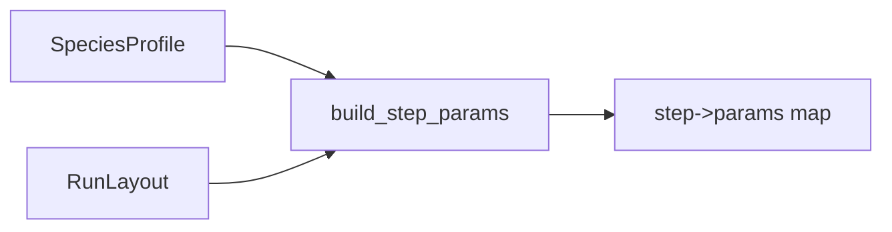

# RNA: Configs

High-level helpers for building per-step parameter maps.

Classes: `SpeciesProfile`, `AmalgkitRunLayout`

Function: `build_step_params(species, layout)`



Example

```python
from pathlib import Path
from metainformant.rna.configs import SpeciesProfile, AmalgkitRunLayout, build_step_params

spec = SpeciesProfile(name="Apis mellifera", taxon_id=7460, tissues=["head", "abdomen"])
layout = AmalgkitRunLayout(base_dir=Path("./work/Apis_mellifera"))
params = build_step_params(spec, layout)
```

Convention: prefer `output/` for working directories, e.g. `base_dir=Path("output/amalgkit/Apis_mellifera")`.


