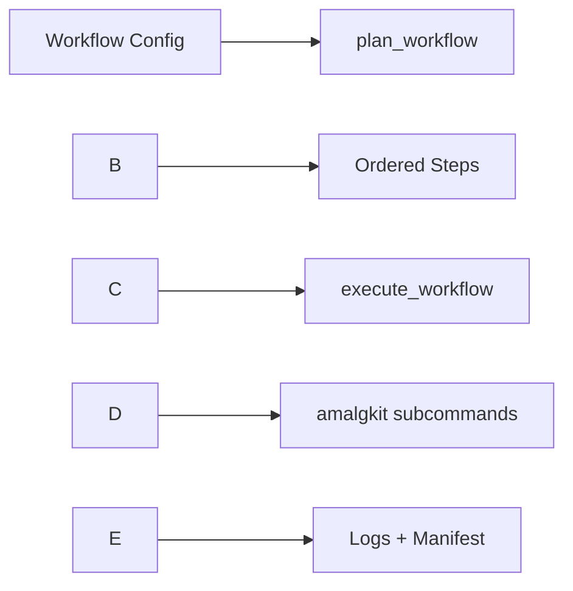

# RNA: Overview

Thin, modular wrapper over the external `amalgkit` CLI with a plan/execute workflow.

## Quick Links

- **[Main Documentation Index](README.md)** - Complete documentation map
- **[API Reference](API.md)** - Complete function documentation
- **[Workflow Guide](workflow.md)** - Workflow planning and execution
- **[Step Documentation](amalgkit/steps/README.md)** - All 11 step guides
- **[Function Index](amalgkit/FUNCTIONS.md)** - Quick function lookup

See: [amalgkit/README.md](amalgkit/README.md), [workflow.md](workflow.md), [CONFIGURATION.md](CONFIGURATION.md).

Advanced: step runners in `metainformant.rna.engine.workflow_steps` provide a stable call surface per subcommand.
See: [Step Documentation](amalgkit/steps/README.md)

Notes

- Ensure `amalgkit` is installed and on PATH; verify using `check_cli_available`
- `execute_workflow` writes per-step logs to `work_dir/logs` and a JSONL manifest to `work_dir/amalgkit.manifest.jsonl`
- To parameterize steps by species/tissues and output layout, see [Configuration Guide](./CONFIGURATION.md#species-profiles)

## Transcriptomic meta-analysis (concept)

Meta-analysis integrates RNA-seq data across studies to detect robust gene expression patterns with improved power. A typical flow:

- Data collection and QC: gather SRA/ENA records, assess read quality (e.g., FastQC), trim adapters (e.g., Trimmomatic/fastp)
- Alignment/quantification: map or quasi-map reads (e.g., HISAT2/STAR or Salmon/RSEM)
- Normalization and batch handling: account for depth/length and correct study-level effects (e.g., ComBat, limma removeBatchEffect)
- Differential expression: within-study DE (e.g., DESeq2, edgeR)
- Meta-analysis of DE: combine evidence across studies (e.g., metaRNASeq; p-value or effect-size aggregation)
- Functional interpretation: GO/pathway enrichment

## Mapping to the amalgkit-based workflow

The `metainformant.rna` wrappers organize these concerns into reproducible steps under a single working directory (default under `output/`).

- Discovery, planning, selection: `metadata` → `integrate` → `config` → `select`
- Acquisition: `getfastq` (downloads raw FASTQ into `work_dir/fastq` by convention)
- Quantification: `quant` (e.g., Salmon) producing per-sample abundances under `work_dir/quant`
- Aggregation: `merge` yielding a merged table such as `work_dir/merged_abundance.tsv`
- Normalization: `cstmm` (count scaling) under `work_dir/cstmm`
- Curation and QC: `curate`, `csca` (sample clustering/assessment), `sanity` (final checks)
- Downstream DE/meta-analysis: export merged counts/TPMs to R/Python tools (e.g., DESeq2/edgeR/metaRNASeq) for study-level DE and cross-study meta-analysis

See [workflow.md](workflow.md) for planning/execution and [Step Documentation](amalgkit/steps/README.md) for per-step details and expected artifacts.

## See Also

### Getting Started
- **[GETTING_STARTED.md](GETTING_STARTED.md)** - Installation and setup
- **[README.md](README.md)** - Complete documentation index

### Core Documentation
- **[workflow.md](workflow.md)** - Workflow planning and execution
- **[Step Documentation](amalgkit/steps/README.md)** - Individual step documentation
- **[CONFIGURATION.md](CONFIGURATION.md)** - Configuration management
- **[API.md](API.md)** - Complete API reference

### Orchestration
- **[ORCHESTRATION.md](ORCHESTRATION.md)** - Orchestrator overview

### References

- metaRNASeq: RNA-seq meta-analysis methodology ([arXiv](https://arxiv.org/abs/1306.3636))
- metaTP: automated metatranscriptomic pipeline with Snakemake ([BMC Bioinformatics](https://bmcbioinformatics.biomedcentral.com/articles/10.1186/s12859-025-06137-w))
- SMAGEXP: Galaxy suite unifying metaMA/metaRNASeq ([arXiv](https://arxiv.org/abs/1802.08251))
- Flimma: federated limma-voom for privacy-preserving DE ([arXiv](https://arxiv.org/abs/2010.16403))
