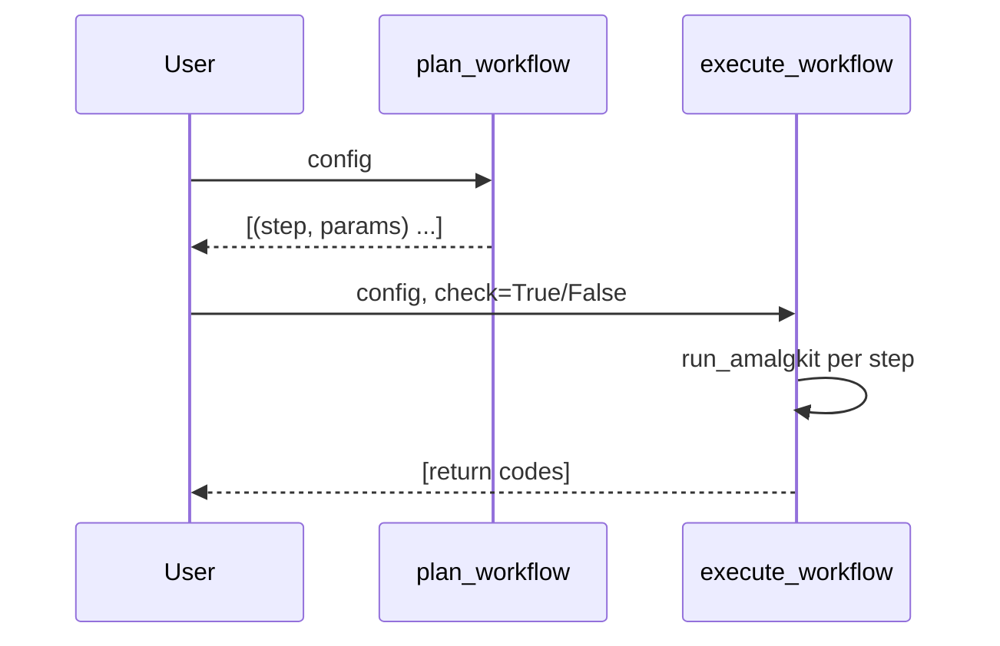

# RNA Workflow

High-level planning and execution live in `metainformant.rna.workflow`.

## Plan

```python
from pathlib import Path
from metainformant.rna.workflow import AmalgkitWorkflowConfig, plan_workflow

cfg = AmalgkitWorkflowConfig(work_dir=Path("output/amalgkit/run1"), threads=4, species_list=["Apis_mellifera"]) 
for name, params in plan_workflow(cfg):
    print(name, params)
```

## Execute

```python
from metainformant.rna.workflow import execute_workflow
codes = execute_workflow(cfg)
print(codes)
```

### From config file

```python
from metainformant.rna.workflow import load_workflow_config, execute_workflow
cfg = load_workflow_config("config/amalgkit_pbarbatus.yaml")
codes = execute_workflow(cfg, check=True)
```

## Per-step params

```python
from metainformant.rna.configs import SpeciesProfile, AmalgkitRunLayout, build_step_params
from metainformant.rna.workflow import plan_workflow_with_params

species = SpeciesProfile(name="Apis mellifera", taxon_id=7460, tissues=["brain"]) 
layout = AmalgkitRunLayout(base_dir=cfg.work_dir)
params_map = build_step_params(species, layout)
steps = plan_workflow_with_params(cfg, params_map)
```

## Artifacts

- Logs under `work_dir/logs/` per step
- JSON Lines manifest at `work_dir/amalgkit.manifest.jsonl`
- Summary JSON at `work_dir/amalgkit.report.json` and Markdown at `work_dir/amalgkit.report.md`

### RNA: Workflow

Plan and execute an `amalgkit`-based workflow using `AmalgkitWorkflowConfig`.

Functions: `plan_workflow`, `plan_workflow_with_params`, `execute_workflow`.



## Example

```python
from pathlib import Path
from metainformant.rna import AmalgkitWorkflowConfig
from metainformant.rna import workflow as wf

cfg = AmalgkitWorkflowConfig(work_dir=Path("./work"), threads=4, species_list=["Apis_mellifera"])
steps = wf.plan_workflow(cfg)
codes = wf.execute_workflow(cfg, check=False)
```

## How this supports meta-analysis

The workflow produces standardized, well-logged artifacts that map to common meta-analysis stages:

- Discovery/selection (`metadata`, `integrate`, `config`, `select`): defines the population of samples across studies
- Acquisition/quantification (`getfastq`, `quant`): yields per-sample abundance estimates using consistent parameters
- Aggregation/normalization (`merge`, `cstmm`): constructs study-agnostic matrices for downstream analysis
- Curation/QC (`curate`, `csca`, `sanity`): ensures input quality and comparability

Downstream, you can:

- Run DE per study and combine with p-value or effect-size methods (e.g., metaRNASeq)
- Apply batch-effect correction on the merged matrix using tools like ComBat or limma
- Perform GO/pathway enrichment using `metainformant.ontology` utilities or external R/Python libraries

All outputs default under `output/` in keeping with repository policy; override via `work_dir` in the config.

## Common Issues and Solutions

### Metadata Format Selection

The workflow intelligently selects metadata files for downstream steps. Steps like `getfastq`, `integrate`, `quant`, and `merge` require **row-per-sample format** with a `run` column containing SRA IDs.

**Issue**: `amalgkit select` creates pivot tables that lack run IDs, causing "No SRA entry found" errors.

**Solution**: The workflow automatically falls back to `metadata.filtered.tissue.tsv` or `metadata.tsv` when pivot tables are detected:

```python
# Automatic detection and fallback in workflow.py
if rows and 'run' not in rows[0]:  # Pivot format detected
    # Use metadata.filtered.tissue.tsv instead
```

### Filter Configuration

**Issue**: Overly restrictive filters can exclude 99%+ of samples.

**Solution**: Start with minimal filtering and adjust based on data quality:

```yaml
# Recommended starting point
filters:
  require_tissue: true  # Essential filter only
  
# Add stricter filters only if needed
filters:
  require_tissue: true
  min_spots: 1000000  # Add only after reviewing initial results
```

### Performance Optimization

**GetFASTQ Acceleration**: Enable parallel downloads and cloud sources for significant speedup:

```yaml
steps:
  getfastq:
    threads: 6           # Parallel processing
    pfd: yes             # Use parallel-fastq-dump
    accelerate: true     # Enable cloud mirrors (AWS/GCP)
    max_size: "50GB"     # Handle large samples
```

**Disk Space Management**: Delete FASTQ files after quantification to prevent disk exhaustion:

```yaml
steps:
  quant:
    threads: 6
    keep_fastq: no       # Delete FASTQs after processing
    redo: no             # Skip already quantified samples
```

**Expected Performance** (with optimizations):
- Download speed: 6x faster with parallel processing
- Cloud sources: 3-5x faster than NCBI only
- Disk usage: 90% reduction with FASTQ cleanup
- Total runtime: ~1-2 days for 300+ samples (vs 6-13 days without optimization)
