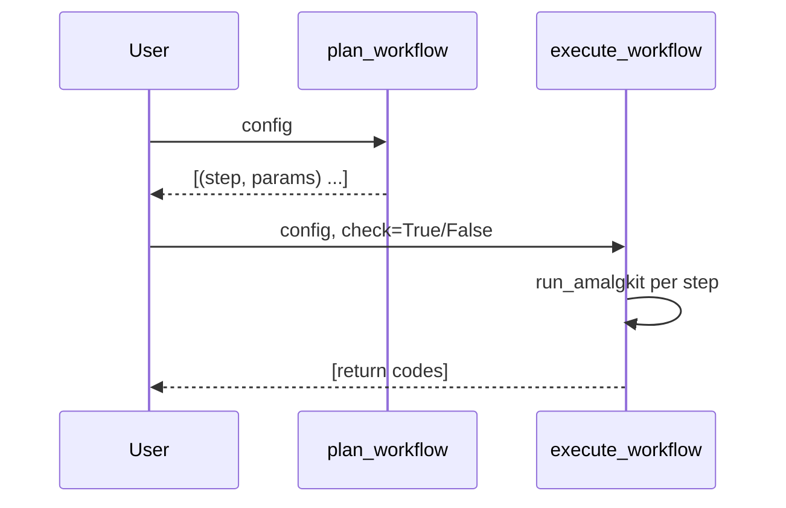

# RNA Workflow

High-level planning and execution live in `metainformant.rna.workflow`.

## Quick Links

- **[API Reference](API.md#workflow-functions)** - Workflow function documentation
- **[Step Documentation](amalgkit/steps/README.md)** - All 11 step guides
- **[Configuration Guide](CONFIGURATION.md)** - Configuration management
- **[Orchestration Guide](ORCHESTRATION.md)** - Orchestrator overview
- **[Main Index](README.md)** - RNA domain master index

## Quick Start

**For multi-species production workflows**, see **[Getting Started Guide](GETTING_STARTED.md)** for:
- Starting parallel workflows for multiple species
- Monitoring progress in real-time
- Troubleshooting common issues
- Performance optimization

**For orchestrator selection**, see **[ORCHESTRATION.md](ORCHESTRATION.md)** to choose the right orchestrator for your needs.

## End-to-End Workflow

The `execute_workflow()` function provides complete end-to-end functionality:

1. **Automatic Genome Setup** (if genome config exists):
   - Validates genome and kallisto index status at startup
   - Downloads genome package if missing
   - Prepares transcriptome FASTA if missing
   - Builds kallisto index if `build_index: yes` and index is missing
   - Only proceeds after genome/index is confirmed ready

2. **Metadata Retrieval**: Downloads sample metadata from NCBI SRA

3. **Immediate Per-Sample Processing** (default behavior):
   - For each sample: download → immediately quantify → immediately delete FASTQ
   - Maximum disk efficiency: only one sample's FASTQs exist at a time
   - Automatic resume: skips already-quantified samples
   - **Per-Sample Workflow Details**: See [Per-Sample Processing](#per-sample-processing) section below

4. **Post-Processing**: Merge, curate, and analyze results

**Path Resolution**: All paths in config files are resolved relative to repository root, allowing configs to work on any drive location (`/home/q/...` or `/media/q/ext6/...`).

## Plan

```python
from pathlib import Path
from metainformant.rna.workflow import AmalgkitWorkflowConfig, apply_step_defaults, plan_workflow

cfg = AmalgkitWorkflowConfig(
    work_dir=Path("output/amalgkit/run1"),
    threads=12,  # Default: 12 threads per species (for single-species workflows)
    species_list=["Apis_mellifera"]
) 
apply_step_defaults(cfg)
for name, params in plan_workflow(cfg):
    print(name, params)
```

## Execute

```python
from metainformant.rna.workflow import execute_workflow
codes = execute_workflow(cfg)
print(codes)
```

**Command-line execution** (recommended for end-to-end workflows):
```bash
# Full end-to-end workflow (all steps)
python3 scripts/rna/run_workflow.py config/amalgkit/amalgkit_pogonomyrmex_barbatus.yaml

# Specific steps only
python3 scripts/rna/run_workflow.py config/amalgkit/amalgkit_pogonomyrmex_barbatus.yaml --steps getfastq quant merge

# Check status
python3 scripts/rna/run_workflow.py config/amalgkit/amalgkit_pogonomyrmex_barbatus.yaml --status

# Print planned steps + exact amalgkit commands (does not execute)
python3 scripts/rna/run_workflow.py config/amalgkit/amalgkit_pogonomyrmex_barbatus.yaml --plan

# Walk through each stage (press Enter before each stage)
python3 scripts/rna/run_workflow.py config/amalgkit/amalgkit_pogonomyrmex_barbatus.yaml --walk

# Show exact command before each stage runs
python3 scripts/rna/run_workflow.py config/amalgkit/amalgkit_pogonomyrmex_barbatus.yaml --show-commands --check
```

The `run_workflow.py` script provides:
- Complete end-to-end execution via `execute_workflow()`
- Automatic genome setup (if genome config exists)
- Per-sample processing: download → quantify → delete FASTQ
- All 11 amalgkit steps in correct order
- Status checking and cleanup operations

See [scripts/rna/README.md](../../scripts/rna/README.md) for complete usage documentation.

**Alternative workflows** (for specialized use cases):
- See [ORCHESTRATION.md](ORCHESTRATION.md) for orchestrator selection
- See [scripts/rna/amalgkit/run_amalgkit.sh](../../scripts/rna/amalgkit/run_amalgkit.sh) for bash-based orchestration

### From config file

```python
from metainformant.rna.workflow import load_workflow_config, execute_workflow

# Load config (paths resolved relative to repo root)
cfg = load_workflow_config("config/amalgkit/amalgkit_pogonomyrmex_barbatus.yaml")

# Execute workflow (automatic genome setup + immediate per-sample processing)
codes = execute_workflow(cfg, check=True)
```

**What happens automatically**:
- Genome download and indexing (if genome config provided)
- Metadata retrieval
- Immediate per-sample processing: download → quant → delete FASTQ
- All organized under `output/amalgkit/`

## Per-step params

```python
from metainformant.rna.configs import SpeciesProfile, AmalgkitRunLayout, build_step_params
from metainformant.rna.workflow import plan_workflow_with_params  # Note: Not exported, use plan_workflow instead

species = SpeciesProfile(name="Apis mellifera", taxon_id=7460, tissues=["brain"]) 
layout = AmalgkitRunLayout(base_dir=cfg.work_dir)
params_map = build_step_params(species, layout)
steps = plan_workflow_with_params(cfg, params_map)
```

## Artifacts

- Logs under `work_dir/logs/` per step
- JSON Lines manifest at `work_dir/amalgkit.manifest.jsonl`
- Summary JSON at `work_dir/amalgkit.report.json` and Markdown at `work_dir/amalgkit.report.md`

### RNA: Workflow

Plan and execute an `amalgkit`-based workflow using `AmalgkitWorkflowConfig`.

Functions: `plan_workflow`, `plan_workflow_with_params`, `execute_workflow`.



## Example

```python
from pathlib import Path
from metainformant.rna import AmalgkitWorkflowConfig
from metainformant.rna import workflow as wf

cfg = AmalgkitWorkflowConfig(
    work_dir=Path("./work"),
    threads=12,  # Default: 12 parallel threads
    species_list=["Apis_mellifera"]
)
steps = wf.plan_workflow(cfg)
codes = wf.execute_workflow(cfg, check=False)
```

## Monitoring Workflows

See **[Getting Started Guide](GETTING_STARTED.md#monitoring-progress)** for comprehensive monitoring instructions.

**Quick monitoring:**
```bash
# Check workflow status
python3 scripts/rna/run_workflow.py config/amalgkit/amalgkit_pogonomyrmex_barbatus.yaml --status

# Detailed status
python3 scripts/rna/run_workflow.py config/amalgkit/amalgkit_pogonomyrmex_barbatus.yaml --status --detailed

# Check running processes
ps aux | grep "run_workflow\|amalgkit" | grep -v grep
```

## How this supports meta-analysis

The workflow produces standardized, well-logged artifacts that map to common meta-analysis stages:

- **Genome setup** (automatic): Downloads genome, prepares transcriptome, builds kallisto index
- Discovery/selection (`metadata`, `integrate`, `config`, `select`): defines the population of samples across studies
- Acquisition/quantification (`getfastq`, `quant`): **Immediate per-sample processing** (default) - download → immediately quantify → immediately delete FASTQ for maximum disk efficiency
- Aggregation/normalization (`merge`, `cstmm`): constructs study-agnostic matrices for downstream analysis
- Curation/QC (`curate`, `csca`, `sanity`): ensures input quality and comparability

**Default Processing Mode**: The workflow uses immediate per-sample processing by default. Each sample is downloaded, quantified, and its FASTQ files deleted before moving to the next sample. This ensures maximum disk efficiency - only one sample's FASTQs exist at any time.

## Per-Sample Processing

The workflow processes each sample individually in a three-step sequence:

1. **Download**: FASTQ files are downloaded for the sample
2. **Quantify**: The sample is immediately quantified against the kallisto index
3. **Delete**: FASTQ files are automatically deleted after successful quantification

This per-sample workflow is implemented in `metainformant.rna.steps.process_samples` and can be used manually via the `quantify_sample()` and `delete_sample_fastqs()` functions.

### Manual Per-Sample Processing

For processing individual samples manually (e.g., for testing or recovery):

```python
from metainformant.rna.steps.quant import quantify_sample
from metainformant.rna.steps.getfastq import delete_sample_fastqs
from metainformant.rna.workflow import load_workflow_config
from metainformant.core.io import read_delimited
from pathlib import Path

# Load config
cfg = load_workflow_config("config/amalgkit/amalgkit_pogonomyrmex_barbatus.yaml")

# Read metadata
metadata_file = cfg.work_dir / "metadata" / "metadata.tsv"
rows = list(read_delimited(metadata_file, delimiter="\t"))
sample_rows = [row for row in rows if row.get("run") == "SRR14740514"]

# Prepare quant params
quant_params = dict(cfg.per_step.get("quant", {}))
quant_params["out_dir"] = str(cfg.per_step.get("quant", {}).get("out_dir", cfg.work_dir / "quant"))
quant_params["threads"] = cfg.threads or 12
quant_params["work_dir"] = str(cfg.work_dir.absolute())  # Required for finding FASTQ files

# Step 1: Quantify
success, message, abundance_path = quantify_sample(
    sample_id="SRR14740514",
    metadata_rows=sample_rows,
    quant_params=quant_params,
    log_dir=cfg.log_dir,
    step_name="quant_SRR14740514",
)

if success and abundance_path and abundance_path.exists():
    # Step 2: Delete FASTQ files
    fastq_dir = Path(cfg.per_step.get("getfastq", {}).get("out_dir", cfg.work_dir / "fastq"))
    delete_sample_fastqs("SRR14740514", fastq_dir)
    print(f"✓ Quantified and cleaned up SRR14740514")
else:
    print(f"✗ Quantification failed: {message}")
```

**Test Script**: A complete test script is available at `scripts/rna/test_quantify_sample.py`:

```bash
python3 scripts/rna/test_quantify_sample.py \
    --sample SRR14740514 \
    --config config/amalgkit/amalgkit_pogonomyrmex_barbatus.yaml
```

### Automatic Cleanup Behavior

The workflow automatically deletes FASTQ files after successful quantification when:

- `keep_fastq: no` is set in the quant configuration (default behavior)
- Quantification completes successfully (abundance.tsv file is created)
- The sample has been processed through the `run_download_quant_workflow()` function

**Note**: The `cleanup_unquantified_samples()` function in `metainformant.rna.orchestration` can be used to process downloaded but unquantified samples in batch:

```python
from metainformant.rna.orchestration import cleanup_unquantified_samples
from pathlib import Path

config_path = Path("config/amalgkit/amalgkit_pogonomyrmex_barbatus.yaml")
quantified, failed = cleanup_unquantified_samples(config_path)
print(f"Quantified: {quantified}, Failed: {failed}")
```

This function:
1. Finds all samples with FASTQ files but no quantification results
2. Quantifies each sample using `quantify_sample()`
3. Deletes FASTQ files after successful quantification using `delete_sample_fastqs()`

Downstream, you can:

- Run DE per study and combine with p-value or effect-size methods (e.g., metaRNASeq)
- Apply batch-effect correction on the merged matrix using tools like ComBat or limma
- Perform GO/pathway enrichment using `metainformant.ontology` utilities or external R/Python libraries

All outputs default under `output/` in keeping with repository policy; override via `work_dir` in the config.

## See Also

### Documentation
- **[API Reference](API.md#workflow-functions)** - Complete workflow function documentation
- **[Function Index](amalgkit/FUNCTIONS.md)** - Quick function lookup
- **[Step Documentation](amalgkit/steps/README.md)** - All 11 step guides
- **[Configuration Guide](CONFIGURATION.md)** - Configuration management
- **[Orchestration Guide](ORCHESTRATION.md)** - Orchestrator overview and selection
- **[Main Index](README.md)** - RNA domain master index

### Getting Started
- **[GETTING_STARTED.md](GETTING_STARTED.md)** - Complete setup and production workflow guide

## Common Issues and Solutions

### Zero-Read Detection and Validation

**Issue**: `amalgkit getfastq` may return success (exit code 0) even when it produces 0 reads, leading to empty FASTQ files and failed quantification.

**Solution**: The workflow includes enhanced validation that:
1. **Immediately validates FASTQ files** after getfastq completes
2. **Detects 0-read cases** by checking for actual FASTQ files
3. **Distinguishes failure modes**:
   - SRA exists but no FASTQ → conversion failure
   - No files at all → 0-read download or early failure
4. **Fails fast** instead of waiting indefinitely for files that will never appear

**Implementation**: The download worker (`_download_worker`) validates file existence before reporting success:

```python
# Validation happens immediately after getfastq returns
if success:
    # Extract fastq_dir from getfastq_params
    fastq_dir = Path(getfastq_params.get("out_dir", ""))
    
    # Check for FASTQ files
    has_fastq = any(sample_dir.glob("*.fastq*"))
    
    if not has_fastq:
        # Check if SRA exists (conversion may have failed)
        has_sra = any(sample_dir.glob("*.sra"))
        if has_sra:
            logger.warning("SRA exists but no FASTQ (conversion may have failed)")
        else:
            logger.warning("getfastq succeeded but no files found (0 reads)")
        success = False  # Mark as failed
```

**Error Messages**:
- `⚠️ SRA exists but no FASTQ (conversion may have failed or produced 0 reads)` - SRA file downloaded but conversion failed
- `⚠️ getfastq succeeded but no files found (may have produced 0 reads)` - No files at all, likely 0-read case

### Metadata Format Selection

The workflow intelligently selects metadata files for downstream steps. Steps like `getfastq`, `integrate`, `quant`, and `merge` require **row-per-sample format** with a `run` column containing SRA IDs.

**Issue**: `amalgkit select` creates pivot tables that lack run IDs, causing "No SRA entry found" errors.

**Solution**: The workflow automatically falls back to `metadata.filtered.tissue.tsv` or `metadata.tsv` when pivot tables are detected:

```python
# Automatic detection and fallback in workflow.py
if rows and 'run' not in rows[0]:  # Pivot format detected
    metadata_file = work_dir / "metadata" / "metadata.filtered.tissue.tsv"
    # Use metadata.filtered.tissue.tsv instead
```

### Filter Configuration

**Issue**: Overly restrictive filters can exclude 99%+ of samples.

**Solution**: Start with minimal filtering and adjust based on data quality:

```yaml
# Recommended starting point
filters:
  require_tissue: true  # Essential filter only
  
# Add stricter filters only if needed
filters:
  require_tissue: true
  min_spots: 1000000  # Add only after reviewing initial results
```

### Performance Optimization

**GetFASTQ Acceleration**: Enable parallel downloads and cloud sources for significant speedup:

```yaml
steps:
  getfastq:
    threads: 10  # Default: 10 parallel downloads
    aws: yes     # Use AWS Open Data Program
    gcp: yes     # Use Google Cloud
    ncbi: yes    # Use NCBI directly
```

**Automatic Optimizations** (handled by `run_workflow.py`):
- SRA wrapper script: Disables conservative size checks
- Temp directory: Uses project location instead of `/tmp`
- Batched processing: Configurable via `num_download_workers` in config (~20-50 GB peak)
- Auto-activation: Virtual environment detection and activation

### Disk Space Management

**Issue**: Large samples (100+ GB) fail with "disk-limit exceeded"

**Solution**: The script automatically handles this:
1. Creates wrapper: `output/sra_temp/fasterq-dump` with `--size-check off`
2. Sets temp directory to project location (not `/tmp`)
3. Batches processing: Downloads → Quantifies → Deletes FASTQs
4. Peak usage: ~20-50 GB (10 samples at a time)

No manual configuration needed - all handled automatically by the workflow script.

### Virtual Environment Issues

**Issue**: "amalgkit: command not found" or import errors

**Solution**: Scripts automatically discover and activate virtual environments using `uv`:
```bash
# Prerequisites: venv must exist with amalgkit installed
# If not set up, run:
#   uv venv .venv  # or /tmp/metainformant_venv on ext6 filesystems
#   source .venv/bin/activate  # or /tmp/metainformant_venv/bin/activate
#   uv pip install -e .
#   uv pip install git+https://github.com/kfuku52/amalgkit

# Just run the script - no manual activation needed
# Scripts automatically discover venv location (.venv or /tmp/metainformant_venv)
# For single-species workflows with parallel downloads:
# Configure num_download_workers in config file (see CONFIGURATION.md)
python3 scripts/rna/run_workflow.py config/amalgkit/amalgkit_pogonomyrmex_barbatus.yaml

# For multiple species, run run_workflow.py separately for each species config
# Parallel downloads are controlled via num_download_workers in each config file
```

**Note**: On ext6 filesystems (which don't support symlinks), scripts automatically use `/tmp/metainformant_venv` if `.venv` creation fails. The venv discovery handles both locations transparently.

### SRA Download Failures

**Issue**: fasterq-dump fails with size check errors despite available disk space

**Solution**: Automatic wrapper script injection:
- Script creates: `output/sra_temp/fasterq-dump`
- Adds flag: `--size-check off`
- Symlinks tools: fastp, kallisto, seqkit
- Updates PATH automatically

All handled transparently by the workflow.

**Note**: SRA Toolkit workflows are legacy and have ~0% success rate for large samples. Use `run_workflow.py` for production workflows, which uses ENA-based downloads by default.

### Performance Optimization

**GetFASTQ Acceleration**: Enable parallel downloads and cloud sources for significant speedup:

```yaml
steps:
  getfastq:
    threads: 6           # Parallel processing
    pfd: yes             # Use parallel-fastq-dump
    accelerate: true     # Enable cloud mirrors (AWS/GCP)
```

**Disk Space Management**: Delete FASTQ files after quantification to prevent disk exhaustion:

```yaml
steps:
  quant:
    threads: 6
    keep_fastq: no       # Delete FASTQs after processing
    redo: no            # Skip already quantified samples
```

**Expected Performance** (with ENA workflow):
- Download speed: Fast and reliable (100% success rate)
- Direct ENA downloads: 3-5x faster than SRA Toolkit
- Disk usage: Minimal (immediate per-sample cleanup)
- Total runtime: ~7.5 minutes per sample average
