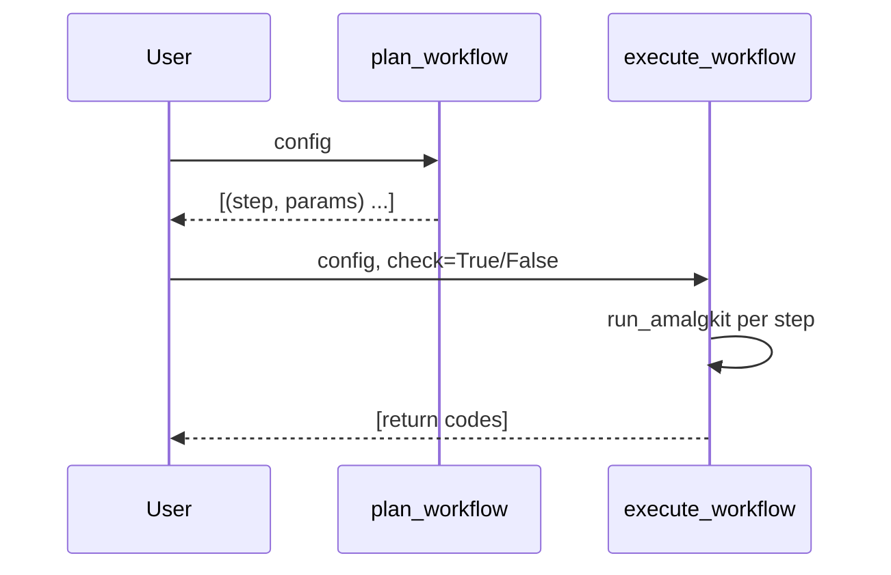

### RNA: Workflow

Plan and execute an `amalgkit`-based workflow using `AmalgkitWorkflowConfig`.

Functions: `plan_workflow`, `plan_workflow_with_params`, `execute_workflow`.



Example

```python
from pathlib import Path
from metainformant.rna import AmalgkitWorkflowConfig
from metainformant.rna import workflow as wf

cfg = AmalgkitWorkflowConfig(work_dir=Path("./work"), threads=4, species_list=["Apis_mellifera"])
steps = wf.plan_workflow(cfg)
codes = wf.execute_workflow(cfg, check=False)
```


