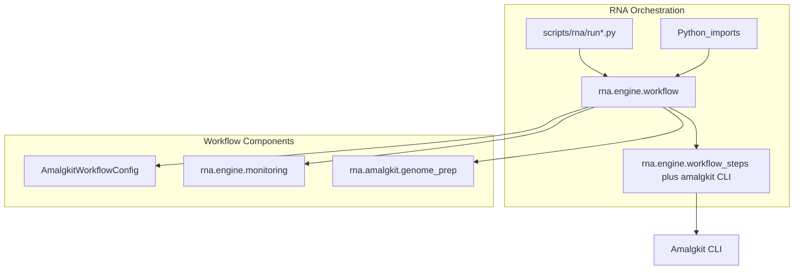
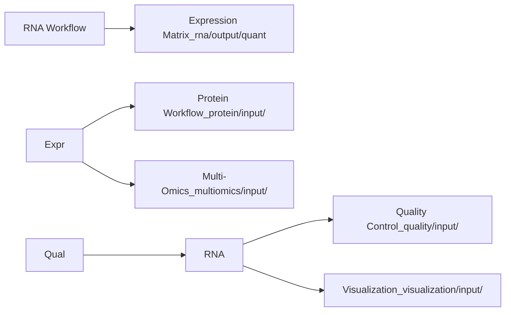

# RNA Workflow Orchestration

## Overview

The RNA module provides workflow orchestration for RNA-seq analysis, from raw sequencing data to expression quantification. Planning and execution live in `metainformant.rna.engine.workflow` and integrate with the amalgkit CLI for production runs.

## Architecture


```mermaid
flowchart TB
    subgraph "RNA Orchestration"
        ScriptsRna[scripts/rna/run*.py] --> EngineWorkflow[rna.engine.workflow]
        PythonApi[Python_imports] --> EngineWorkflow
        EngineWorkflow --> StepsRna[rna.engine.workflow_steps plus amalgkit CLI]
    end

    subgraph "Workflow Components"
        ConfigAmalgkit[AmalgkitWorkflowConfig]
        MonitoringEngine[rna.engine.monitoring]
        GenomePrep[rna.amalgkit.genome_prep]
        StepsRna
    end

    EngineWorkflow --> ConfigAmalgkit
    EngineWorkflow --> MonitoringEngine
    EngineWorkflow --> GenomePrep
    StepsRna --> AmalgkitCli[Amalgkit CLI]
```

## Workflow Types

### Complete Amalgkit Workflow

The main workflow orchestrates all 11 amalgkit steps for single-species analysis:

```python
from pathlib import Path

from metainformant.rna.engine.workflow import AmalgkitWorkflowConfig, execute_workflow

config = AmalgkitWorkflowConfig(
    work_dir=Path("output/rna/species"),
    species_list=["Apis_mellifera"],
    threads=12,
)

results = execute_workflow(config, check=False)
if results.success:
    print(f"Completed {results.successful_steps}/{results.total_steps} steps")
else:
    failed = [s for s in results.steps_executed if not s.success]
    print(f"Workflow failed at: {[s.step_name for s in failed]}")
```

### Simulated expression data

For synthetic RNA-style counts, use the simulation package (not the RNA workflow engine), for example `metainformant.simulation.models.rna` (`simulate_rnaseq_counts`, `simulate_bulk_rnaseq`). See [simulation documentation](../simulation/index.md).

## Configuration

### AmalgkitWorkflowConfig

Complete configuration for amalgkit workflows:

```python
@dataclass
class AmalgkitWorkflowConfig:
    """Configuration for amalgkit RNA-seq workflow execution."""

    work_dir: Path                           # Base working directory
    threads: int = 6                        # Number of threads
    species_list: list[str] = field(default_factory=list)
    log_dir: Path | None = None             # Optional log directory
    manifest_path: Path | None = None       # Workflow manifest
    auto_install_amalgkit: bool = True     # Auto-install amalgkit

    # Advanced configuration
    genome: dict[str, Any] | None = None    # Genome configuration
    filters: dict[str, Any] = field(default_factory=dict)
```

### Config Loading

Load configuration from YAML files with environment variable overrides:

```python
from pathlib import Path

from metainformant.rna.engine.workflow import load_workflow_config

config = load_workflow_config(Path("config/amalgkit/amalgkit_species.yaml"))
```

## Workflow Steps

The complete amalgkit workflow consists of 11 orchestrated steps:

| Step | Function | Purpose |
|------|----------|---------|
| **metadata** | `run_metadata` | NCBI SRA metadata retrieval |
| **config** | `run_config` | Configuration file generation |
| **select** | `run_select` | Sample selection and filtering |
| **getfastq** | `run_getfastq` | FASTQ file generation from SRA |
| **integrate** | `run_integrate` | Local FASTQ metadata integration |
| **quant** | `run_quant` | Transcript abundance quantification |
| **merge** | `run_merge` | Expression matrix merging |
| **cstmm** | `run_cstmm` | Cross-species TMM normalization |
| **curate** | `run_curate` | Outlier removal and bias correction |
| **csca** | `run_csca` | Cross-species correlation analysis |
| **sanity** | `run_sanity` | Workflow integrity validation |

### Step execution

Individual steps are invoked from `execute_workflow` via `metainformant.rna.engine.workflow_steps` and the amalgkit Python API in `metainformant.rna.amalgkit`. See source under `src/metainformant/rna/engine/workflow_steps.py` for the dispatch map (`metadata`, `quant`, etc.).

## Monitoring and Progress

### Real-time Monitoring

Workflows provide comprehensive monitoring capabilities:

```python
from pathlib import Path

from metainformant.rna.engine.monitoring import analyze_species_status

status = analyze_species_status(Path("output/amalgkit/Apis_mellifera/work"))
print(f"Completed: {status.get('completed')}, Quantified: {status.get('quantified')}")
```

### Progress initialization

```python
from pathlib import Path

from metainformant.rna.engine.monitoring import initialize_progress_tracking

info = initialize_progress_tracking(Path("config/amalgkit/amalgkit_pogonomyrmex_barbatus.yaml"))
print(info)
```

## Genome Preparation

### Integrated Genome Setup

Workflows can include genome preparation as part of the orchestration:

Genome download and index preparation are handled inside `execute_workflow` (via `prepare_reference_genome`) and documented in [amalgkit/genome_preparation.md](amalgkit/genome_preparation.md). Lower-level helpers live in `metainformant.rna.amalgkit.genome_prep`.

### Genome Requirements

Each species requires:
- **Reference genome** (FASTA format)
- **Gene annotation** (GTF/GFF format)
- **Transcriptome index** (kallisto/salmon)
- **Genome index** (for alignment-based quantification)

## Error Handling and Recovery

### Checkpoint-based Recovery

Workflows support resuming from any failed step:

`execute_workflow` skips steps that already have completion artifacts unless the config marks them for redo. Inspect `results.steps_executed` on the returned `WorkflowExecutionResult` for per-step outcomes.

### Error Classification

Errors are categorized for appropriate handling:

```python-snippet
# Network errors (retry)
if "connection" in str(error).lower():
    # Implement retry logic

# Data errors (manual intervention)
elif "corrupt" in str(error).lower():
    # Log for manual review

# Configuration errors (fail fast)
elif "config" in str(error).lower():
    raise ValueError(f"Configuration error: {error}")
```

## Performance Optimization

### Parallel Processing

Workflows optimize for available resources:

```python
# Automatic thread distribution
config = AmalgkitWorkflowConfig(
    work_dir=Path("output/rna"),
    threads=24,  # Total threads available
    # Workflow distributes threads across steps automatically
)

# Manual thread control per step
config.per_step = {
    "getfastq": {"threads": 12},  # Download heavy
    "quant": {"threads": 24},     # CPU intensive
}
```

### Memory Management

Large dataset handling:

```python
# Streaming processing for large datasets
with io.read_delimited("large_metadata.csv", chunk_size=1000) as reader:
    for chunk in reader:
        process_chunk(chunk)

# Temporary / partial download cleanup (see docstring for parameters)
from metainformant.rna.core.cleanup import cleanup_partial_downloads

cleanup_partial_downloads(Path("output/amalgkit/Species_name/work"), dry_run=False)
```

## Integration with Other Modules

### Cross-module use

Downstream modules consume RNA outputs (quantification tables, paths under `output/amalgkit/`) via files or Python loaders in those domains. Wire them in your own script after `execute_workflow` completes; there is no single `execute_protein_workflow` facade tied to RNA results.

### Data Flow


```mermaid
flowchart LR
    RNArnaWorkflow[RNA Workflow] --> ExprexpressionMatrixRna/output/quant[Expression Matrix_rna/output/quant]
    Expr --> ProtproteinWorkflowProtein/input/[Protein Workflow_protein/input/]
    Expr --> Multimulti-omicsMultiomics/input/[Multi-Omics_multiomics/input/]

    RNA --> QualqualityControlQuality/input/[Quality Control_quality/input/]
    Qual --> RNA

    RNA --> VizvisualizationVisualization/input/[Visualization_visualization/input/]
```

## Production Deployment

### Script-based Execution

Production workflows use script orchestrators:

```bash
# Complete species workflow
python3 scripts/rna/run_workflow.py \
    --config config/amalgkit/amalgkit_pogonomyrmex_barbatus.yaml

# Check status
python3 scripts/rna/run_workflow.py \
    --config config/amalgkit/amalgkit_pogonomyrmex_barbatus.yaml \
    --status

# Cleanup and retry failed samples
python3 scripts/rna/run_workflow.py \
    --config config/amalgkit/amalgkit_pogonomyrmex_barbatus.yaml \
    --cleanup-unquantified
```

### Batch Processing

Multi-species batch execution:

```bash
# Process multiple species
for species in "Apis_mellifera" "Pogonomyrmex_barbatus"; do
    python3 scripts/rna/run_workflow.py \
        --config "config/amalgkit/amalgkit_${species}.yaml" &
done
wait
```

## Testing and Validation

### Workflow testing

Use real configs and `tmp_path` (see project real-implementation policy). Smoke-test planning without running amalgkit:

```python
from pathlib import Path

import pytest

from metainformant.rna.engine.workflow import AmalgkitWorkflowConfig, plan_workflow


def test_plan_workflow_smoke(tmp_path: Path) -> None:
    config = AmalgkitWorkflowConfig(
        work_dir=tmp_path / "workflow",
        species_list=["test_species"],
        threads=1,
    )
    steps = plan_workflow(config)
    assert isinstance(steps, list)
```

Full end-to-end tests require amalgkit, reference data, and network or local FASTQ; see `tests/` and [amalgkit/testing_coverage.md](amalgkit/testing_coverage.md).

## Best Practices

### Configuration Management

1. **Use YAML configs** for complex workflows
2. **Environment overrides** for deployment-specific settings
3. **Validation** before workflow execution
4. **Version control** of configuration files

### Error Handling

1. **Graceful degradation** for non-critical failures
2. **Detailed logging** for troubleshooting
3. **Checkpoint recovery** for long-running workflows
4. **Resource cleanup** on failure

### Performance

1. **Resource monitoring** during execution
2. **Parallel processing** where appropriate
3. **Memory management** for large datasets
4. **Progress tracking** for user feedback

### Maintenance

1. **Regular updates** of amalgkit and dependencies
2. **Version pinning** for reproducible results
3. **Documentation updates** with workflow changes
4. **Testing** after dependency updates

## Troubleshooting

### Common Issues

**Workflow hangs during download:**
```bash
python3 -c "from metainformant.rna.engine.monitoring import check_active_downloads; print(check_active_downloads())"
```

**Memory issues with large datasets:**
```python
# Reduce threads in AmalgkitWorkflowConfig or YAML (e.g. threads: 4)
config = AmalgkitWorkflowConfig(work_dir=Path("output/amalgkit/work"), threads=4, species_list=["Apis_mellifera"])
```

**Genome index issues:**
```bash
# Rebuild genome indices
python3 scripts/rna/setup_genome.py \
    --species Apis_mellifera \
    --rebuild-indices
```

## Related Documentation

- **[RNA Overview](../rna/README.md)** - RNA module overview
- **[Amalgkit Integration](../rna/amalgkit/)** - Amalgkit-specific documentation
- **[Configuration](CONFIGURATION.md)** - Configuration management
- **[Monitoring](amalgkit/monitoring.md)** - Progress tracking and monitoring
- **[Orchestration Guide](../ORCHESTRATION.md)** - Overall orchestration paradigm
- **[Core Workflow](../core/workflow.md)** - BaseWorkflowOrchestrator details