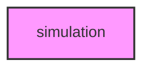

# SIMULATION

## Overview
Functionality for simulation.

## 📦 Contents


## 📊 Structure


```mermaid
graph TD
    simulation[simulation]
    style simulation fill:#f9f,stroke:#333,stroke-width:2px
```

## Usage
Import module:
```python
from metainformant.simulation import ...
```
