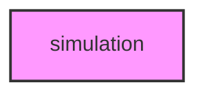

# SIMULATION

## Overview
Evolutionary and Population Genetics Simulation module for METAINFORMANT.

## 📦 Contents
- **[models/](models/)**
- **[visualization/](visualization/)**
- **[workflow/](workflow/)**
- `[__init__.py](__init__.py)`

## 📊 Structure



## Usage
Import module:
```python
from metainformant.simulation import ...
```
