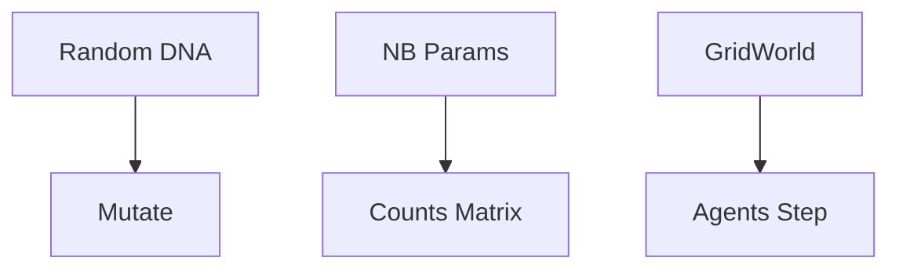

### Simulation: Overview

Synthetic generators across domains and toy agent-based models.

- Sequences: random DNA/protein, mutation
- RNA counts: negative binomial
- Agents: `GridWorld`, `Agent`

See: [Sequences](./sequences.md), [RNA Counts](./rna_counts.md), [Agents](../../src/metainformant/simulation/README.md#agent-based-models-agentspy).
