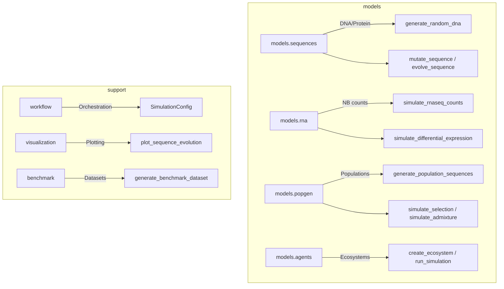

### Simulation Module

The `metainformant.simulation` module provides synthetic data generators for biological
sequences, RNA-seq count data, population genetics scenarios, and agent-based ecosystem
models. It also includes workflow orchestration, benchmark dataset generation, and
visualization tools for simulation results.

---

## Architecture



---

## Submodules

| Submodule              | Description                                                           |
|------------------------|-----------------------------------------------------------------------|
| `models.sequences`     | Random DNA/protein generation, mutation, evolution, gene duplication   |
| `models.rna`           | Negative binomial RNA-seq counts, differential expression, scRNA-seq  |
| `models.popgen`        | Population genetics: bottlenecks, expansion, selection, admixture     |
| `models.agents`        | Agent-based ecosystem modeling with typed agents on grid environments  |
| `workflow`             | Pipeline configuration, execution, calibration, and validation        |
| `visualization`        | Plotting simulation results (sequences, population dynamics, agents)  |
| `benchmark`            | Synthetic benchmark datasets for method evaluation                    |

---

## Quick Start

### Sequence Simulation

```python
from metainformant.simulation import generate_random_dna, mutate_sequence, evolve_sequence

# Generate a random DNA sequence with 60% GC content
seq = generate_random_dna(500, gc_content=0.6)

# Introduce 10 point mutations
mutated = mutate_sequence(seq, n_mut=10)

# Evolve over 1000 generations
evolved = evolve_sequence(seq, generations=1000, mutation_rate=0.001)
```

### RNA-seq Count Simulation

```python
from metainformant.simulation import simulate_rnaseq_counts, simulate_differential_expression
import numpy as np

# Simple count matrix (1000 genes x 10 samples)
counts = simulate_rnaseq_counts(n_genes=1000, n_samples=10)

# Differential expression between two conditions
fold_changes = np.array([2.0, -1.5, 3.0, 0.5, -2.0])
expression, labels = simulate_differential_expression(
    n_samples=20, n_features=5000, fold_changes=fold_changes,
)
```

### Population Genetics

```python
from metainformant.simulation import (
    generate_population_sequences,
    generate_genotype_matrix,
    simulate_bottleneck_population,
    simulate_selection,
)

# Generate a population of 50 sequences with neutral variation
pop_seqs = generate_population_sequences(n_sequences=50, length=1000, theta=0.01)

# Simulate a population bottleneck
bottleneck_seqs = simulate_bottleneck_population(
    n_sequences=100, length=500, bottleneck_size=10,
)

# Simulate natural selection
selected = simulate_selection(
    n_sequences=100, length=500, selection_coefficient=0.01,
)
```

### Agent-Based Ecosystem Modeling

```python
from metainformant.simulation import create_ecosystem, run_simulation, Agent

# Create an ecosystem with producer and consumer agents
eco = create_ecosystem(
    n_agents=50,
    agent_types=["producer", "consumer"],
    environment_size=(20, 20),
)

# Run simulation for 100 steps
snapshots = run_simulation(eco, n_steps=100)
```

### Workflow Orchestration

```python
from metainformant.simulation import (
    SimulationConfig,
    create_simulation_config,
    run_simulation_workflow,
    validate_simulation_output,
)

config = create_simulation_config(
    simulation_type="sequence_evolution",
    parameters={"n_sequences": 100, "generations": 500},
)
results = run_simulation_workflow(config)
validation = validate_simulation_output(results)
```

---

## Key Classes

### `Agent`

Individual agent in an ecosystem. Has position, energy, age, type, and properties.

### `GridAgent` / `GridWorld`

Lightweight agent and 2D grid environment for spatial simulations.

### `Ecosystem`

Complex ecosystem containing typed agents (producer, consumer, decomposer) with
interaction rules and population dynamics.

### `SimulationConfig`

Dataclass for configuring simulation workflows with parameters, output paths, and
execution settings.

---

## Reproducibility

All simulation functions accept an `rng` parameter (`random.Random` instance) for
deterministic results:

```python
import random
from metainformant.simulation import generate_random_dna

rng = random.Random(42)
seq1 = generate_random_dna(100, rng=rng)

rng = random.Random(42)
seq2 = generate_random_dna(100, rng=rng)

assert seq1 == seq2  # Identical with same seed
```

---

## See Also

- **[Sequence Simulation](sequences.md)** -- Detailed DNA/protein simulation docs
- **[RNA Count Simulation](rna_counts.md)** -- RNA-seq count generation
- `metainformant.math` -- Population genetics theory (coalescent, drift)
