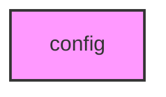

# CONFIG

## Overview
Functionality for config.

## 📦 Contents


## 📊 Structure


```mermaid
graph TD
    config[config]
    style config fill:#f9f,stroke:#333,stroke-width:2px
```

## Usage
Import module:
```python
from metainformant.config import ...
```
