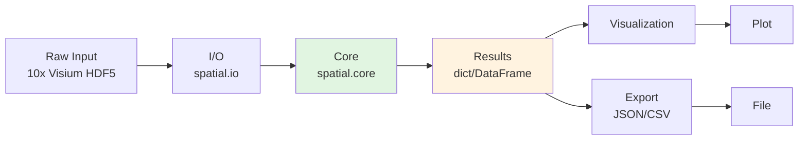

# Integration: spatial

## Related Modules
- [singlecell](../singlecell/README.md)
- [networks](../networks/README.md)
- [visualization](../visualization/README.md)
- [quality](../quality/README.md)

## Import Patterns
### Minimal (standalone)
```python
from metainformant import spatial
results = spatial.analyze(data)
```

### Full integration
```python
from metainformant.spatial import load_visium, load_merfish, load_xenium
from metainformant.core import io, config, cache, logging
from metainformant.visualization import quickplot
```

## Data Flow Architecture


## Cross-Module Workflows

### spatial + gwas + phenotype
```python
from metainformant import spatial, gwas, phenotype
prep = spatial.load_visium(raw_data)
gwas_res = gwas.associate(prep)
pheno = phenotype.correlate(gwas_res)
visualization.manhattan(gwas_res)
```

### spatial + cloud
```python
from metainformant.cloud import submit_batch
job = submit_batch(
    module="spatial",
    parameters=dict(algorithm="accurate", workers=16)
)
results = job.wait().download()
```

### spatial + visualization (detailed)
```python
from metainformant.spatial import analyze
from metainformant.visualization import plot_heatmap, plot_timeseries, plot_network
res = analyze(data)
plot_heatmap(res.matrix)
plot_timeseries(res.series)
```

## Shared Infrastructure
| Service | Provided By | Used By |
|---------|-------------|---------|
| Config | `core.utils.config` | All modules (including spatial) |
| Logging | `core.utils.logging` | Structured logs across pipeline |
| I/O | `core.io` | Format-agnostic read/write |
| Caching | `core.io.cache` | Expensive computations |
| DB | `core.db` | Persistent metadata (optional) |

## Data Contract
Spatial produces standardized result containers compatible with downstream modules:
```python
class Result:
    values: dict            # Primary output data
    stats: dict             # Summary statistics
    metadata: dict          # Provenance, timestamps, config
    to_table() -> pd.DataFrame
    to_json() -> str
```
All modules that accept `Result` objects can operate on spatial's output directly.

## Multi-Module Orchestration
See [docs/agents/](../agents/MULTI_AGENT_WORKFLOWS.md) for agent-driven multi-module pipelines.
