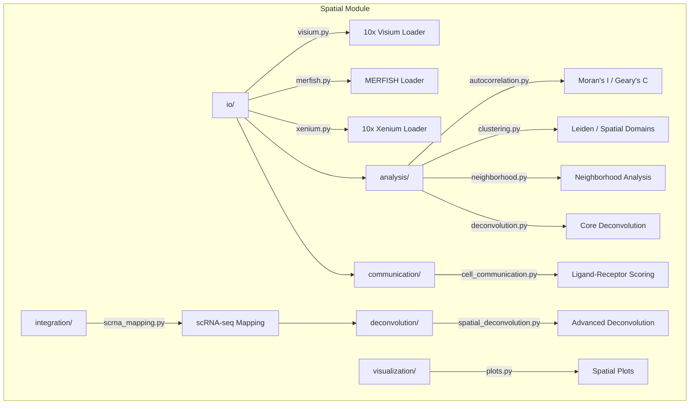

# Spatial Transcriptomics

## Overview

Spatial transcriptomics analysis module for METAINFORMANT. Covers platform I/O (Visium, MERFISH, Xenium), spatial statistics, cell-cell communication, deconvolution, and scRNA-seq integration.

## Contents

- **io/** - Platform loaders for Visium, MERFISH, and Xenium data formats
- **analysis/** - Spatial autocorrelation, clustering, neighborhood analysis, deconvolution
- **communication/** - Ligand-receptor interaction scoring and communication networks
- **deconvolution/** - Advanced cell type deconvolution with reference profiles and niche ID
- **integration/** - scRNA-seq to spatial mapping, label transfer, gene imputation
- **niche/** - Tissue niche identification via spatial smoothing and K-Means clustering
- **visualization/** - Spatial scatter plots, tissue overlays, expression maps

## Architecture



## Usage

```python
from metainformant.spatial.io import visium, merfish, xenium
from metainformant.spatial.analysis import autocorrelation, clustering, neighborhood
from metainformant.spatial.communication import cell_communication
from metainformant.spatial.deconvolution import spatial_deconvolution
from metainformant.spatial.integration import scrna_mapping
```
