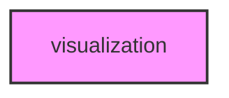

# VISUALIZATION

## Overview
Visualization and plotting utilities module for METAINFORMANT.

## 📦 Contents
- **[analysis/](analysis/)** — Statistical, quality, and dimensionality reduction plots
- **[genomics/](genomics/)** — Genomics-specific visualizations (expression, trees, networks)
- **[plots/](plots/)** — Core plotting functions (basic, specialized, animations)
- **[config/](config/)** — Color palettes and theme configuration
- **[dashboards/](dashboards/)** — Composite and interactive dashboard layouts
- **[interactive_dashboards/](interactive_dashboards/)** — Interactive web-based dashboards

## 📊 Structure



## Usage
Import module:
```python
from metainformant.visualization import ...
```
