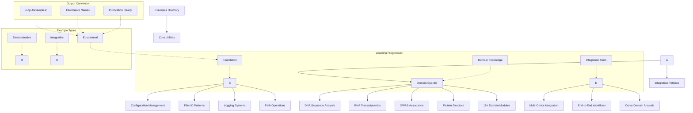
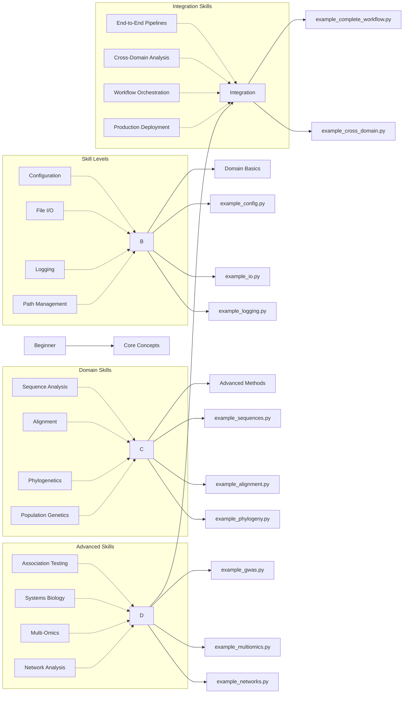
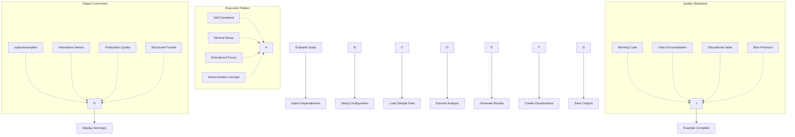

# METAINFORMANT Examples

This directory contains educational examples demonstrating METAINFORMANT usage patterns across all biological analysis domains. These examples complement the production scripts in `scripts/` by focusing on learning concepts rather than production workflows.

## Overview

METAINFORMANT examples are organized by domain to match the module structure, providing focused, runnable demonstrations of key functionality. Examples focus on education and concept demonstration, while production workflows belong in `scripts/`.

## Example Organization Framework



### Learning Pathway Architecture



### Example Execution Framework



### Domain Coverage Matrix

```mermaid
graph TD
    AdomainExamples[Domain Examples] --> BcoreInfrastructure[Core Infrastructure]
    A --> CmolecularBiology[Molecular Biology]
    A --> DstatisticalGenetics[Statistical Genetics]
    A --> EsystemsBiology[Systems Biology]
    A --> FappliedBiology[Applied Biology]

    B --> Gconfiguration&I/o[Configuration & I/O]
    B --> Hlogging&Paths[Logging & Paths]
    B --> IworkflowOrchestration[Workflow Orchestration]

    C --> JdnaSequences[DNA Sequences]
    C --> KrnaExpression[RNA Expression]
    C --> LproteinStructure[Protein Structure]
    C --> M[Epigenetics]

    D --> NgwasAnalysis[GWAS Analysis]
    D --> OpopulationGenetics[Population Genetics]
    D --> PstatisticalModeling[Statistical Modeling]

    E --> Qnetworks&Pathways[Networks & Pathways]
    E --> Rmulti-omicsIntegration[Multi-Omics Integration]
    E --> Ssingle-cellAnalysis[Single-Cell Analysis]

    F --> Tontology&Annotation[Ontology & Annotation]
    F --> UphenotypeAnalysis[Phenotype Analysis]
    F --> Vecology&Diversity[Ecology & Diversity]
    F --> WlifeEvents[Life Events]


    subgraph "Coverage Areas"
        X20+ExampleCategories[20+ Example Categories] -.-> A
        Y50+IndividualExamples[50+ Individual Examples] -.-> A
        ZeducationalProgression[Educational Progression] -.-> A
    end

    subgraph "Quality Assurance"
        AArunnableCode[Runnable Code] -.-> A
        BBrealData[Real Data] -.-> A
        CCcomprehensiveDocs[Comprehensive Docs] -.-> A
        DDtestingValidation[Testing Validation] -.-> A
    end
```



## Directory Structure

```
examples/
├── README.md                    # This file
├── AGENTS.md                    # AI development documentation
├── core/                        # Core utilities examples
│   ├── README.md
│   ├── example_config.py        # Configuration management
│   ├── example_io.py            # File I/O patterns
│   ├── example_logging.py       # Logging patterns
│   ├── example_paths.py         # Path management
│   └── example_workflow.py      # Basic workflow orchestration
├── dna/                         # DNA analysis examples
│   ├── README.md
│   ├── example_sequences.py     # Sequence processing basics
│   ├── example_alignment.py     # Sequence alignment
│   ├── example_phylogeny.py     # Phylogenetic tree building
│   └── example_population.py    # Population genetics statistics
├── rna/                         # RNA analysis examples
│   ├── README.md
│   ├── example_amalgkit.py      # Amalgkit workflow basics
│   └── example_quantification.py # Expression quantification
├── gwas/                        # GWAS examples
│   ├── README.md
│   ├── example_association.py   # Association testing
│   └── example_visualization.py # GWAS visualization
├── [other domains]/             # Examples for all modules
│   ├── README.md
│   └── example_*.py             # Domain-specific examples
└── integration/                 # Cross-domain examples
    ├── README.md
    ├── example_dna_rna.py       # Multi-omic integration
    ├── example_multiomics.py    # Cross-omics analysis
    └── example_complete_workflow.py # End-to-end pipeline
```

## Examples vs Scripts

METAINFORMANT provides both **examples** (for learning) and **scripts** (for production):

| Type | Purpose | Location | Focus |
|------|---------|----------|--------|
| **Examples** | Learning concepts | `examples/` | Educational, minimal demos |
| **Scripts** | Production workflows | `scripts/` | Full orchestrators, batch processing |

### When to Use Examples
- Learning new concepts and APIs
- Understanding module functionality
- Testing ideas before production
- Educational purposes and tutorials

### When to Use Scripts
- Production data analysis
- Batch processing workflows
- Automated pipelines
- End-to-end data processing

## Core Examples (`examples/core/`)

Foundational examples demonstrating METAINFORMANT core utilities:

### Configuration Management
```bash
# Learn how to load configs with environment overrides
python examples/core/example_config.py
```

### File I/O Patterns
```bash
# See JSON, CSV, and JSONL file operations
python examples/core/example_io.py
```

### Logging Setup
```bash
# Learn structured logging patterns
python examples/core/example_logging.py
```

### Path Management
```bash
# Understand path validation and containment
python examples/core/example_paths.py
```

## Domain Examples

### DNA Analysis (`examples/dna/`)

Learn fundamental DNA sequence analysis concepts:

#### Sequence Processing Basics
```bash
# Learn FASTA reading, reverse complement, GC content
python examples/dna/example_sequences.py
```

#### Sequence Alignment
```bash
# Understand pairwise sequence alignment
python examples/dna/example_alignment.py
```

#### Phylogenetics
```bash
# Build neighbor-joining phylogenetic trees
python examples/dna/example_phylogeny.py
```

#### Population Genetics
```bash
# Calculate nucleotide diversity and Tajima's D
python examples/dna/example_population.py
```

### RNA Analysis (`examples/rna/`)

Explore transcriptomic analysis workflows:

#### Amalgkit Workflow Basics
```bash
# Learn amalgkit workflow setup and planning
python examples/rna/example_amalgkit.py
```

#### Expression Quantification
```bash
# Understand gene expression quantification
python examples/rna/example_quantification.py
```

### GWAS (`examples/gwas/`)

Genome-wide association study examples:

#### Association Testing
```bash
# Learn basic association test implementation
python examples/gwas/example_association.py
```

#### GWAS Visualization
```bash
# Create Manhattan and QQ plots
python examples/gwas/example_visualization.py
```

## Integration Examples (`examples/integration/`)

Cross-domain workflows demonstrating multi-omic analysis:

#### DNA-RNA Integration
```bash
# Use DNA coordinates for RNA analysis
python examples/integration/example_dna_rna.py
```

#### Multi-Omics Analysis
```bash
# Cross-omics correlation and integration
python examples/integration/example_multiomics.py
```

#### Complete Workflow
```bash
# End-to-end bioinformatics pipeline
python examples/integration/example_complete_workflow.py
```

## Running Examples

### Prerequisites

```bash
# Install METAINFORMANT and dependencies
uv sync

# Activate environment
source .venv/bin/activate  # or uv run for commands
```

### Execution

```bash
# Run any example
python examples/core/example_config.py
python examples/dna/example_sequences.py
python examples/gwas/example_association.py

# Examples create output in output/examples/
# Results are saved with informative names
```

### Example Output Structure

All examples follow consistent output patterns:

```
output/examples/
├── core/
│   ├── config_example.json
│   └── io_example.csv
├── dna/
│   ├── sequences_analysis.json
│   ├── alignment_results.json
│   ├── phylogeny_tree.newick
│   └── population_stats.json
├── gwas/
│   ├── association_results.json
│   └── manhattan_plot.png
└── integration/
    └── multiomics_correlations.json
```

## Testing Examples

Examples are tested via `tests/test_examples.py`:

```bash
# Run all example tests
python -m pytest tests/test_examples.py -v

# Run specific example test
python -m pytest tests/test_examples.py::TestExamples::test_dna_sequences -v
```

## Contributing Examples

### Example Guidelines

1. **Educational Value**: Each example should teach a specific METAINFORMANT concept
2. **Self-Contained**: Examples should run independently with minimal setup
3. **Well-Documented**: Include comprehensive comments and docstrings
4. **Follow Patterns**: Use core utilities (io, paths, logging) consistently
5. **Output to `output/examples/`**: Save results with informative names

### Adding New Examples

1. **Choose Topic**: Identify a useful pattern from METAINFORMANT modules
2. **Create Example**: Write complete, runnable code following the template
3. **Add Documentation**: Include README and inline comments
4. **Test Example**: Ensure example works and is well-tested
5. **Update Index**: Add to examples/README.md and domain README

### Example Template

```python
#!/usr/bin/env python3
"""Brief description of what this example demonstrates.

This example shows:
- Key concept 1
- Key concept 2
- Key concept 3

Usage:
    python examples/domain/example_name.py [--options]
"""

from __future__ import annotations

from pathlib import Path
from metainformant.core import io, paths, logging
from metainformant.domain import module_function

def main():
    """Main example function."""
    # Setup
    logger = logging.get_logger(__name__)
    output_dir = Path("output/examples/domain")
    output_dir.mkdir(parents=True, exist_ok=True)

    # Example code with clear comments
    result = module_function(...)

    # Save results
    io.dump_json(result, output_dir / "result.json")

    print(f"Example complete. Results saved to {output_dir}")

if __name__ == "__main__":
    main()
```

## Related Documentation

- **Scripts Documentation**: [`scripts/README.md`](../scripts/README.md) - Production workflow scripts
- **Core Documentation**: [`docs/core/`](../docs/core/) - Core utilities documentation
- **Domain Documentation**: [`docs/<domain>/`](../docs/) - Module-specific documentation
- **Testing**: [`docs/testing.md`](../docs/testing.md) - Testing patterns and examples

These examples provide practical guidance for learning METAINFORMANT across all biological analysis domains.

