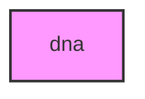

# DNA

## Overview
Functionality for dna.

## 📦 Contents
- `[example_alignment.py](example_alignment.py)`
- `[example_phylogeny.py](example_phylogeny.py)`
- `[example_population.py](example_population.py)`
- `[example_sequences.py](example_sequences.py)`

## 📊 Structure



## Usage
Import module:
```python
from metainformant.dna import ...
```
