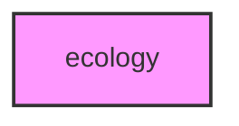

# ECOLOGY

## Overview
Functionality for ecology.

## Contents
- `[example_community.py](example_community.py)`

## Structure



## Usage
Import module:
```python
from metainformant.ecology import ...
```
