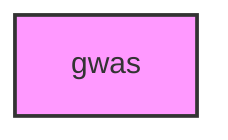

# GWAS

## Overview
Functionality for gwas.

## Contents
- `[example_association.py](example_association.py)`
- `[example_visualization.py](example_visualization.py)`

## Structure



## Usage
Import module:
```python
from metainformant.gwas import ...
```
