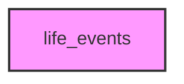

# LIFE_EVENTS

## Overview
Functionality for life_events.

## 📦 Contents
- `[example_events.py](example_events.py)`

## 📊 Structure



## Usage
Import module:
```python
from metainformant.life_events import ...
```
