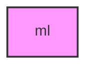

# ML

## Overview
Functionality for ml.

## 📦 Contents
- `[example_pipeline.py](example_pipeline.py)`

## 📊 Structure


```mermaid
graph TD
    ml[ml]
    style ml fill:#f9f,stroke:#333,stroke-width:2px
```

## Usage
Import module:
```python
from metainformant.ml import ...
```
