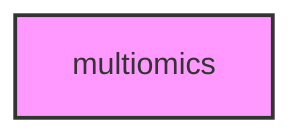

# MULTIOMICS

## Overview
Functionality for multiomics.

## 📦 Contents
- `[example_integration.py](example_integration.py)`

## 📊 Structure



## Usage
Import module:
```python
from metainformant.multiomics import ...
```
