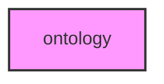

# ONTOLOGY

## Overview
Functionality for ontology.

## 📦 Contents
- `[example_go.py](example_go.py)`

## 📊 Structure



## Usage
Import module:
```python
from metainformant.ontology import ...
```
