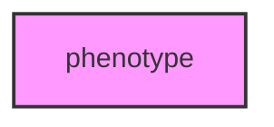

# PHENOTYPE

## Overview
Functionality for phenotype.

## 📦 Contents
- `[example_traits.py](example_traits.py)`

## 📊 Structure



## Usage
Import module:
```python
from metainformant.phenotype import ...
```
