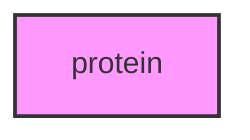

# PROTEIN

## Overview
Functionality for protein.

## 📦 Contents
- `[example_sequences.py](example_sequences.py)`

## 📊 Structure



## Usage
Import module:
```python
from metainformant.protein import ...
```
