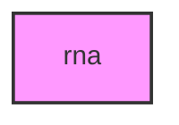

# RNA

## Overview
Functionality for rna.

## 📦 Contents
- `[example_amalgkit.py](example_amalgkit.py)`
- `[example_quantification.py](example_quantification.py)`

## 📊 Structure



## Usage
Import module:
```python
from metainformant.rna import ...
```
