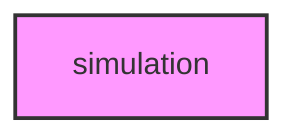

# SIMULATION

## Overview
Functionality for simulation.

## 📦 Contents
- `[example_simulation.py](example_simulation.py)`

## 📊 Structure



## Usage
Import module:
```python
from metainformant.simulation import ...
```
