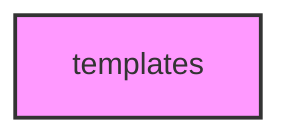

# TEMPLATES

## Overview
Functionality for templates.

## 📦 Contents
- `[base_template.py](base_template.py)`
- `[dna_template.py](dna_template.py)`
- `[ml_template.py](ml_template.py)`

## 📊 Structure



## Usage
Import module:
```python
from metainformant.templates import ...
```
