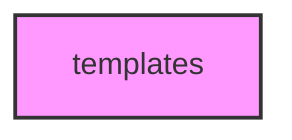

# TEMPLATES

## Overview
Functionality for templates.

## Contents
- `[base_template.py.j2](base_template.py.j2)`
- `[dna_template.py.j2](dna_template.py.j2)`
- `[ml_template.py.j2](ml_template.py.j2)`

## Structure


```mermaid
graph TD
    templates[templates]
    style templates fill:#f9f,stroke:#333,stroke-width:2px
```

## Usage
Import module:
```python
from metainformant.templates import ...
```
