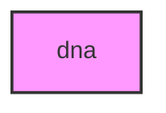

# DNA

## Overview
Functionality for dna.

## 📦 Contents
- `[run_dna_analysis.py](run_dna_analysis.py)`

## 📊 Structure


```mermaid
graph TD
    dna[dna]
    style dna fill:#f9f,stroke:#333,stroke-width:2px
```

## Usage
Import module:
```python
from metainformant.dna import ...
```
