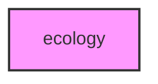

# ECOLOGY

## Overview
Functionality for ecology.

## 📦 Contents
- `[run_ecology_analysis.py](run_ecology_analysis.py)`

## 📊 Structure



## Usage
Import module:
```python
from metainformant.ecology import ...
```
