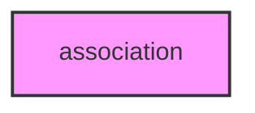

# ASSOCIATION

## Overview
Functionality for association.

## 📦 Contents
- `[run_association.py](run_association.py)`

## 📊 Structure



## Usage
Import module:
```python
from metainformant.association import ...
```
