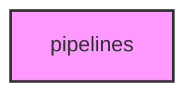

# PIPELINES

## Overview
Functionality for pipelines.

## 📦 Contents
- BeeWAS compatibility wrappers now forward to `projects/apis_gwas/scripts/beewas/`.
- `[run_analysis.py](run_analysis.py)`
- `[run_genome_scale_gwas.py](run_genome_scale_gwas.py)`
- `[run_pbarbatus_analysis.py](run_pbarbatus_analysis.py)`
- `[run_pbarbatus_gwas.py](run_pbarbatus_gwas.py)`

## 📊 Structure



## Usage
Import module:
```python
from metainformant.pipelines import ...
```

BeeWAS project commands should be run from `projects/apis_gwas`; the wrappers in
this directory are transitional import/CLI compatibility shims.
