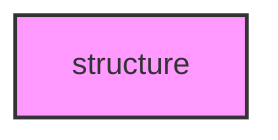

# STRUCTURE

## Overview
Functionality for structure.

## 📦 Contents
- `[run_kinship.py](run_kinship.py)`
- `[run_pca.py](run_pca.py)`

## 📊 Structure



## Usage
Import module:
```python
from metainformant.structure import ...
```
