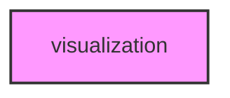

# VISUALIZATION

## Overview
Functionality for visualization.

## 📦 Contents
- `[generate_missing_plots.py](generate_missing_plots.py)`
- `[visualizations.py](visualizations.py)`

## 📊 Structure



## Usage
Import module:
```python
from metainformant.visualization import ...
```
