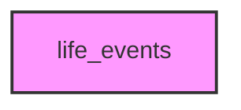

# LIFE_EVENTS

## Overview
Functionality for life_events.

## 📦 Contents
- `[analyze_intervention.py](analyze_intervention.py)`
- `[compare_groups.py](compare_groups.py)`
- `[export_embeddings.py](export_embeddings.py)`
- `[generate_statistical_summary.py](generate_statistical_summary.py)`
- `[generate_synthetic_data.py](generate_synthetic_data.py)`
- `[generate_visualizations.py](generate_visualizations.py)`
- `[interpret_predictions.py](interpret_predictions.py)`
- `[learn_embeddings.py](learn_embeddings.py)`
- `[life_course_example.py](life_course_example.py)`
- `[predict_outcomes.py](predict_outcomes.py)`
- `[run_life_events_analysis.py](run_life_events_analysis.py)`
- `[train_model.py](train_model.py)`
- `[validate_data.py](validate_data.py)`
- `[visualize_sequences.py](visualize_sequences.py)`

## 📊 Structure



## Usage
Import module:
```python
from metainformant.life_events import ...
```
