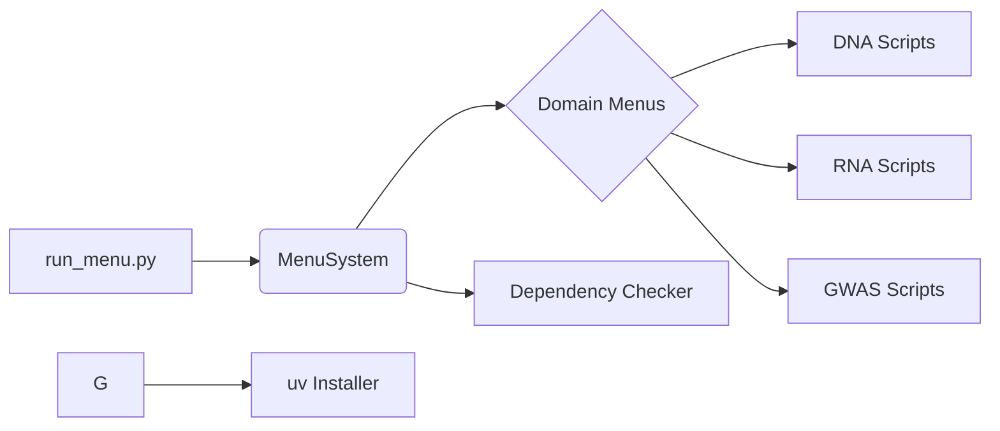

# SPEC: Menu System

Technical specification for the CLI menu and navigation system.

## Design Goals

1. **Zero-Config Startup**: The menu should launch without requiring prior configuration.
2. **Dependency Discovery**: Automatically detect which optional dependency groups are installed.
3. **Interactive Installation**: Offer to install missing dependencies using `uv`.
4. **Hierarchical Navigation**: Organize scripts by domain (DNA, RNA, GWAS, etc.).

## Architecture

## Key Behaviors

- **Exit Codes**: Returns `0` on normal exit, `1` on critical error.
- **State**: Stateless between invocations; reads script list on each launch.

## Related Documentation

- **README**: [README.md](README.md) - Usage guide.
- **AGENTS**: [AGENTS.md](AGENTS.md) - AI contributions.
- **Parent Spec**: [scripts/SPEC.md](../SPEC.md)
