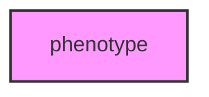

# PHENOTYPE

## Overview
Functionality for phenotype.

## 📦 Contents
- `[load_antwiki_example.py](load_antwiki_example.py)`
- `[run_phenotype_analysis.py](run_phenotype_analysis.py)`
- `[scrape_antwiki.py](scrape_antwiki.py)`
- `[test_scraper_cloudscraper.py](test_scraper_cloudscraper.py)`
- `[verify_phenotype_expansion.py](verify_phenotype_expansion.py)`

## 📊 Structure



## Usage
Import module:
```python
from metainformant.phenotype import ...
```
