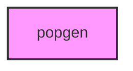

# POPGEN

## Overview
Population genetics analysis scripts package.

## 📦 Contents
- `[__init__.py](__init__.py)`
- `[analysis.py](analysis.py)`
- `[analyze.py](analyze.py)`
- `[generate_dataset.py](generate_dataset.py)`
- `[report.py](report.py)`
- `[visualize.py](visualize.py)`

## 📊 Structure



## Usage
Import module:
```python
from metainformant.popgen import ...
```
