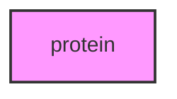

# PROTEIN

## Overview
Functionality for protein.

## 📦 Contents
- `[run_protein_analysis.py](run_protein_analysis.py)`

## 📊 Structure



## Usage
Import module:
```python
from metainformant.protein import ...
```
