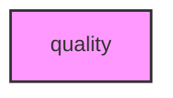

# QUALITY

## Overview
Functionality for quality.

## 📦 Contents
- `[run_quality_control.py](run_quality_control.py)`

## 📊 Structure



## Usage
Import module:
```python
from metainformant.quality import ...
```
