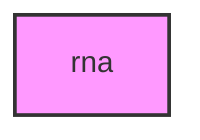

# RNA

## Overview
Functionality for rna.

## 📦 Contents
- `[_setup_utils.py](_setup_utils.py)`
- `[check_environment.py](check_environment.py)`
- `[discover_species.py](discover_species.py)`
- `[filter_valid_samples.py](filter_valid_samples.py)`
- `[process_samples_sequential.py](process_samples_sequential.py)`
- `[recover_missing_batch.py](recover_missing_batch.py)`
- `[recover_missing_parallel.py](recover_missing_parallel.py)`
- `[run_workflow.py](run_workflow.py)`
- `[run_workflow_tui.py](run_workflow_tui.py)`
- `[setup_genome.py](setup_genome.py)`
- `[validate_all_species_workflow.py](validate_all_species_workflow.py)`
- `[verify_fallback.py](verify_fallback.py)`
- `[verify_rna.py](verify_rna.py)`
- `[verify_tui.py](verify_tui.py)`

## 📊 Structure



## Usage
Import module:
```python
from metainformant.rna import ...
```
